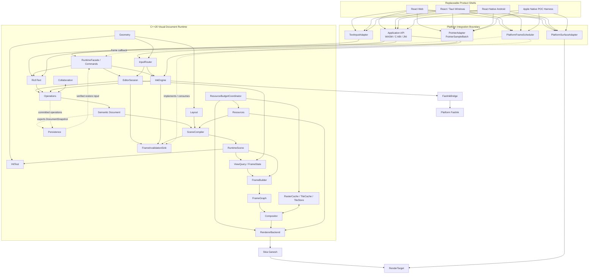
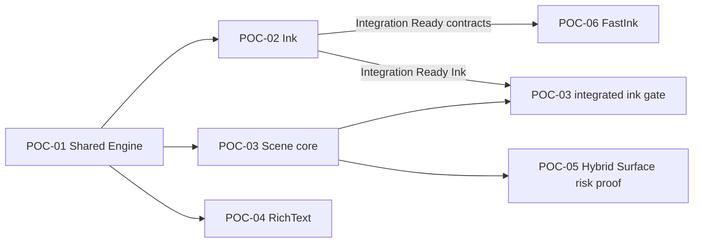

# Canvas v2 项目总体框架

> 状态：Architecture Baseline v1.2；当前阶段：POC-01 / Accepted，POC-02 / Integration Ready / Validating，POC-03 已解除启动阻塞，POC-04 / Validating；主路线：C++20 + Skia Ganesh + 可替换平台 Shell

Canvas v2 的正式定义是 **Visual Document Runtime**。它不是一个单纯的白板应用、Skia Renderer 或跨平台 UI 框架，而是整个产品体系共享的语义文档、编辑、笔迹、文本、场景、渲染、持久化与协作运行时。

本文档固定项目边界和不可随意漂移的架构决策。模块契约、阶段任务、验证方法和决策依据分别见：

- [系统架构](architecture/SYSTEM_ARCHITECTURE.md)
- [分阶段交付计划](planning/STAGED_DELIVERY_PLAN.md)
- [验证策略](quality/VERIFICATION_STRATEGY.md)
- [Vibe 架构研究结论](research/VIBE_ARCHITECTURE_FINDINGS.md)
- [架构决策记录](adr/README.md)

## 1. 产品定义

Canvas v2 为 Web、Windows、macOS、iOS、iPadOS、Android 和复用 Web target 的 ChromiumOS 环境提供同一套文档与画布语义。V1 支持责任分为四级：Web/Windows/Android 是正式 Product Tier A；macOS/iOS/iPadOS 是持续验证共享 Runtime 的 Portability Tier B；ChromiumOS 是 Web Reuse Target；Headless 是测试/reference Utility Target。Apple 产品 Shell 和 Headless 公共产品 API 另行 ADR。平台 UI 可以替换，核心数据与行为不能分叉。

长期能力边界包括：

- 无限画布、页面、容器、结构化布局和多视口。
- Shape、Vector、Image、PDF、Connector 和外部内容。
- Vector、Dab/Pixel 与 Hybrid Ink，以及独立低延迟 FastInk。
- RichText、Table、Sticky、Comment Anchor 和语义搜索。
- Selection、Tools、History、Clipboard、Text Edit 与 Presence。
- SceneCompiler、FrameGraph、Compositor、多级 Tile Cache。
- 本地持久化、离线编辑、多人协作、导出和 Headless 渲染。

这些能力属于架构容量，不代表全部进入 V1 实现。

## 2. V1 范围

### 2.1 V1 实现节点

- `Page`：V1 的语义内容根，可声明内容/导出边界；它不是 Viewport，Viewport 始终属于 `EditorSession`。单 Page 还是 `DocumentRoot → Page*` 的长期产品模型由 R2 schema ADR 决定。
- `Shape`：基础几何图元与样式。
- `Image`：外部资源引用、布局和绘制。
- `VectorPath`：可编辑矢量路径。
- `RichText`：节点从第一版保存 paragraphs、runs、styles 和 attributes；`TextEditSession` 另行提供 selection、caret 和 composition。
- `VectorStroke`：保留语义中心线和笔刷参数。
- `DabStroke`：支持纹理/dab 类型笔刷，不把所有 Stroke 简化为 `SkPath`。

### 2.2 只冻结扩展边界

以下节点不进入 V1 功能实现，但类型体系、SceneCompiler、布局和资源边界不得阻止后续加入：

- Structural：`Section`、`Frame`、`Group`、`Table`、`Sticky`。
- Graphics：`PDF`、`Connector`。
- Ink：`HybridStroke`。
- Domain：`Comment` + `Anchor`。
- External：`Embed`、`Video`、`ExternalSurface`。
- 复杂权限对象、AI 对象和 Presentation 专用对象。

`Comment` 是领域对象与 anchor 的组合，不作为普通 RenderNode。`ExternalSurface` 只由 POC-05 验证未来 Overlay 架构，不进入 V1 产品实现，也不承诺纹理零拷贝。

### 2.3 V1 协作范围

V1 包含 Collaboration MVP：

- 对象操作同步、Presence、操作去重和断网队列。
- 重连、快照引导和随机交错后的基本收敛。
- 文档状态、EditorSession 和 Presence 严格分离。

复杂 RichText 冲突、企业权限、完整历史压缩和大规模会话不是 V1 阻断项，分别通过后续 ADR 处理。

## 3. 平台矩阵

| Tier | 平台 | 当前 Shell/Target | V1 责任 |
| --- | --- | --- | --- |
| Product Tier A | Web | React + TypeScript / WASM | 完整产品、WebGL、IME、性能、发布与支持门禁 |
| Product Tier A | Windows | React + Tauri / C ABI | 完整产品、Native Canvas Region、输入、性能、发布与支持门禁 |
| Product Tier A | Android | React Native + Native `CanvasView` / JNI | 完整产品；MotionEvent/历史点直接进入 C++，不经过 RN JS |
| Portability Tier B | macOS | native harness / C ABI + ObjC++ | 共享 Runtime、Ganesh/Metal、核心 conformance；无 V1 产品 Shell 承诺 |
| Portability Tier B | iOS / iPadOS | universal native runner / C ABI + ObjC++ | iPhone/iPad runner 与核心 conformance；无 V1 产品 Shell 承诺 |
| Reuse Target | ChromiumOS | 复用 Web target | 继承 Web 产品语义；平台 FastInk 为可选 capability |
| Utility Target | Headless | internal runner | test/reference/golden 与内部受控 export；无 V1 公共 server/batch API |

跨平台共享的是 Runtime，不是 UI 框架。Toolbar、Inspector、Dialog、Share、Account 和 Navigation 留在 Shell；Document、Operations、Ink、Text、Scene、HitTest、Renderer 与 Persistence 留在 C++ Runtime。Serialization 是 Operations、Persistence 和 Bridge 使用的版本化 codec 机制，不是独立领域状态所有者。

React/Tauri 和 React Native 是当前接受的 Tier A 产品选择；长期不变量是窄 Bridge、native canvas/surface 边界以及高频 Pointer/IME/Render 数据面不经过不必要的 JS 往返。替换 Shell framework 需要产品/平台决策和 contract regression evidence；只有改变上述 Runtime 边界时才构成架构变更。

## 4. 固定总体架构



主渲染链固定为：

```text
Semantic Document
    → SceneCompiler
    → RuntimeScene
    → ViewQuery / FrameState
    → Render Tree
    → FrameBuilder
    → FrameGraph
    → Compositor
    → RendererBackend
    → Skia Ganesh
    → RenderTarget
```

`PlatformSurfaceAdapter` 在平台侧拥有 HTML Canvas/WebGL context、HWND/swapchain、ANativeWindow/EGLSurface、CAMetalLayer/drawable 和 Headless surface 的生命周期，通过 acquire/resize/present/recover 契约提供 `RenderTarget`。`RendererBackend` 不拥有窗口、View 或 native surface handle。Skia 是 GFX backend，不拥有 Document、Editor、Ink 或 Text 语义；Graphite/WebGPU 只能作为未来 RendererBackend，不得反向改变上层接口。

## 5. Runtime 模块

| 模块 | 权威职责 | 明确不负责 |
| --- | --- | --- |
| RuntimeFacade | Application API 的命令、查询、能力与生命周期入口 | 高频 Pointer/IME 数据面、平台 UI |
| InputRouter | Pointer batch 的顺序、设备/手势路由和 Editor/Ink 分发 | Application commands、IME 文本状态 |
| FrameInvalidationSink | Runtime 定义、host 实现的帧请求边界；携带 View/revision/generation | 平台 VSync 实现、Document 写入 |
| Geometry | 坐标/矩阵、bounds、path 与稳健几何 primitives | Viewport ownership、渲染或文档写入 |
| Document | 语义节点、层级、样式、资源引用、版本 | Skia 对象、选区、GPU 缓存 |
| Operations | 唯一持久写入口、事务、回放、协作操作 | 平台输入与绘制 |
| EditorSession | Selection、Hover、Tools、Snap、History、Clipboard | 文档持久化真相 |
| RichText | TextDocument 的 paragraphs/runs/styles/attributes；TextEditSession 的 selection/caret/composition | 平台 IME UI |
| InkEngine | Pointer 批次、StrokeSession、笔刷语义、Canonical Stroke | 平台直接送显 |
| Layout | Document/RichText 的确定性派生布局接口与 layout records | 持久语义真相、平台 widget 布局 |
| HitTest | 基于 RuntimeScene/SpatialIndex 的 world-space 命中查询 | Tool state、Selection ownership |
| SceneCompiler | Document 到 RuntimeScene 的确定性增量编译 | 文档写入 |
| RuntimeScene | 多视口共享的布局、world bounds、空间索引、render/hit-test records、资源引用和 world-space invalidation | Viewport、可见集合、screen damage、Selection/HUD |
| ViewQuery / FrameState | 单视口可见集合、clip、LOD、scale bucket、target 参数和 screen damage | 共享场景真相、持久状态 |
| FrameBuilder | 合并 Scene、View、Editor overlay、Preview、Presence 和 ExternalSurface placement，生成不可变帧计划 | 文档写入和平台 surface 生命周期 |
| FrameGraph | Pass、依赖、资源生命周期 | 工具和文档规则 |
| Compositor | Background/Content/Ink/Overlay/Selection/HUD 合成 | 文档操作 |
| RendererBackend | 将帧计划通过 Ganesh 绘制到调用方提供的 RenderTarget | HWND/ANativeWindow/CAMetalLayer 生命周期 |
| TileCache | L1/L2/L3 缓存契约、预算、失效 | 权威内容存储 |
| ResourceBudgetCoordinator | 统一协调 decoded resource、Canvas/Skia cache、transient 和 surface 内存预算/压力 | Document 语义、假装完全拥有 Skia 内部 cache |
| Resources | 图片、字体、外部资源加载与版本 | 平台文件对话框 |
| Persistence | 快照、操作日志、迁移、崩溃恢复 | 网络 transport |
| Collaboration | Operations envelope/merge、离线队列、重连与 Presence channel | EditorSession History、平台 transport UI |

`Geometry` 是无状态基础模块。`Layout` 和 `HitTest` 是正式逻辑边界，但其实现可以在 R1 依赖图中落为 `core/scene/layout`、`core/scene/hit_test` 与 `core/text/layout` 子模块；不得因此把它们的公共职责从 Runtime 中删除或让平台各自复制。

## 6. 状态与生命周期

六类状态必须独立：

1. **Document State**：可保存、可同步的语义事实。
2. **EditorSession State**：Selection、Hover、Tool、TextEditSession、Viewport。
3. **Collaboration Presence**：在线成员、远端光标、临时选区和连接状态。
4. **RuntimeScene State**：多视口共享的布局、空间索引、Render Tree 和 world-space invalidation，可重建。
5. **View/Frame State**：Viewport 查询结果、visible set、screen damage、Selection/HUD 和当前帧计划，按 view/frame 短暂存在。
6. **GPU/Cache State**：纹理、display list、tile 和设备资源，可丢弃。

任何缓存或 GPU 设备丢失都不得改变 Document。Presence 不进入文件，EditorSession 不成为协作事实，Document 不保存 Skia 或平台句柄。

多个 View 可以共享同一 Document、RuntimeScene 和受 revision 约束的 resource cache；每个
View 的 EditorSession、History intention、Text composition、Active Stroke、FrameState 和
未决 frame callback 独立。View 销毁只清理本 View 的临时状态，不得连带销毁其他 View
仍在使用的共享状态。GPU context/cache 是否共享由 Renderer/Platform policy 决定。

## 7. 核心接口基线

### 7.1 Pointer 与 Ink

`PointerSampleBatch` 批量携带 pointer ID、位置、压力、倾角、接触尺寸、时间戳、设备类型和历史样本。平台适配器负责归一化，Android 不逐点穿过 RN JS。

坐标链固定为 `Node Local → Page/World → View Logical → Device Pixel → Platform Screen`。Platform PointerAdapter 先规范化到 View Logical，再使用带 ViewId/revision 的 viewport snapshot 逆变换到 Page/World；Document/Canonical geometry 只保存 Page/World 语义坐标，DPR 与像素舍入不进入 Document。

`StrokeSession` 同时产生：

- `Preview Stroke`：允许预测和临时质量，用于最低延迟反馈。
- `Canonical Stroke`：稳定、可编辑、可持久化并进入 Document。

二者共享 Stroke ID 和版本化 `BrushDescriptor` 语义；descriptor 至少包含 brush type/version、semantic parameters 和所需 ResourceId/ContentHash。Dab/texture 随机流必须使用按 algorithm、brush version、StrokeId 与 stream 分域的 deterministic seed/PRNG，不得依赖 wall clock 或全局 random。`push()` 允许持续增量构建 Canonical candidate，`end()` 只负责将最终 Canonical Stroke 作为一次原子 Operation 提交；不得把长笔迹的全部 Canonical 计算推迟到 pointer up。Preview 结束后必须能无闪烁交接到 Canonical。

Confirmed samples 不得静默删除、重复或重排；兼容 batch 可以合并。Predicted tail、可完全
替换的 Preview update 和 frame invalidation 可按 revision coalesce。队列必须有容量和延迟
诊断；资源不足时明确 `InputOverrun` 并原子取消 Stroke，不提交部分笔迹。Platform Adapter
报告 pen/touch/hover/eraser/palm capability，InputRouter 统一产品级 arbitration。

### 7.2 FastInk

`StrokeSession` 统一完成 resample、smooth、pressure mapping、prediction 和 rollback，并输出版本化 `PreviewStrokeUpdate`。它至少表达 Stroke ID、update revision、brush descriptor、transform/坐标空间、confirmed representation、predicted tail 和 replace/truncate 语义；具体 vector segment/dab batch 编码由 POC-02 冻结。

`FastInkBridge/FastInkBackend` 固定提供 `begin`、`push(PreviewStrokeUpdate)`、`end`、`cancel`。平台 backend 只负责快速显示和 surface/presentation，不得从 raw pointer sample 重新实现另一套平滑、预测或笔刷语义。核心不知道 DirectComposition、SurfaceControl、DRM、HWC 或硬件 plane。

- Web：使用正常 WASM Skia Preview。
- Windows/Android：实现应用级 native low-latency preview。
- 自有设备：条件式评估 Raw Input、FastInk Service、DMA-BUF/GBM 与 DRM atomic overlay，不阻塞普通应用产品路线。

Runtime 只通过 FrameInvalidationSink 发布带 View/revision/generation 的 frame invalidation。PlatformFrameScheduler 拥有
rAF、Choreographer、DisplayLink、DXGI 或 Headless pump，合并请求并在 VSync callback 中
执行 acquire/render/present；过期 target 不得 present，Preview→Canonical handoff 以实际
visible acknowledgement 为准。

### 7.3 Scene 与缓存

`SceneCompiler` 接收 Document revision/ChangeSet，生成可完整重建、可增量更新的 RuntimeScene。ChangeSet 的 `SemanticChanges` 是 transaction 派生的确定变化，`InvalidationHints` 是可丢弃、可扩大、可重算的优化提示，不进入持久化、协作或 digest。全量编译和相同变更序列的增量编译必须等价。

Document 节点只保存稳定、不可复用的 `ResourceId`，不调用 ResourceManager 或 Persistence。版本化 `ResourceManifest` 将 ResourceId 映射到 ResourceRevision、`sha256:<content-hash>` 和不可变 blob；manifest binding 属于可保存/协作的语义状态并进入 Document digest，下载 URL、本地路径和 decode/GPU 状态不进入。Resources 独立负责 resolve/verify/decode/version，Persistence 通过受控服务原子保存 `DocumentSnapshot`、committed operation continuation、resource manifest 和 blob；两者都不得反向修改节点语义。

恢复关系固定为 `DocumentSnapshot@RecoveryFrontier F + committed Operations F→T =
Document@T`。Document revision 是 Runtime 实例内的发布/失效标记，RecoveryFrontier 是
持久/同步恢复位置；二者一起校验但不能互换。Snapshot 和 continuation 都绑定 Document
identity 与 base/target frontier。Snapshot 只在已提交 transaction 边界创建，并在发布恢复后的 Document 前
原子校验 identity/schema/capability/frontier/digest；它不包含 EditorSession、Presence、
Viewport/Preview、RuntimeScene、GPU/cache 或 blob bytes。运行期编辑与 Undo/Redo 不能通过
恢复旧 Snapshot 绕过 Operation。`ViewportSnapshot`、`DocumentReadView` 与可持久化
`DocumentSnapshot` 是三个不同概念。具体 codec/log/compaction 留给 R2/R4，语义遵循 ADR-0020。

ResourceManifest 在逻辑上属于 DocumentSnapshot/Digest，物理分包不能破坏同一 checkpoint
绑定。任何 log compaction 都必须先证明 Snapshot、manifest、continuation 起点和恢复元数据
已持久、可校验、可读取，之后才能回收 frontier 之前的 Operation prefix；blob GC 仍按内容
可达性独立处理。

缓存接口从首版存在，能力按阶段展开：

- L1：GPU/当前进程快速缓存，V1 产品化实现。
- L2：RAM cache，性能数据证明需要时启用。
- L3：SSD/eMMC 持久 tile，仅自有设备或大文档需求驱动。

FrameGraph 中 Background/Content/Ink/ExternalSurface/Overlay/Selection/HUD 是 logical passes；
backend 可在依赖和视觉等价性不变时 merge、elide 或 reuse。R3 的全局资源预算需要统一观察
decoded resources、Canvas cache、Skia GPU cache、transient allocations 和 surface memory，
不能由各模块分别宣称未超预算。

### 7.4 RichText

`TextDocument` 从第一版包含 paragraphs、runs、styles 和 attributes；`TextEditSession` 管理 selection、caret、composition、undo；`TextInputAdapter` 负责 Web、Windows 和 Android IME 边界。渲染由 TextDocument → TextLayout → SkParagraph 完成。

Canonical RichText 使用 `FontResourceId`/ContentHash 与规范化 fallback chain；系统字体的偶然可用性不能改变跨平台 canonical layout、换行和 selection geometry。平台字体可以用于非 canonical UI，但不得静默替换 Document font resource。

### 7.5 History 与 Undo/Redo

History 属于 EditorSession，只选择本地 intention 和 undo grouping。Undo/Redo 针对当前 Document revision 生成新的、原子的 compensating Operations，经唯一写入口验证、持久化和协作同步；不得移动 Document state pointer、倒退 operation sequence 或改写历史 Operation。

### 7.6 坐标、资源与版本化语义

- 坐标、DPI、输入逆变换、HitTest tolerance 和 ExternalSurface placement 遵循 ADR-0012。
- ResourceId、ResourceManifest、ContentHash、missing/corrupt handling 和 Document digest 遵循 ADR-0013。
- History/Undo/Redo ownership 与 compensating Operation 遵循 ADR-0014。
- canonical binary32、finite-only、canonical zero、checked overflow、版本化算法精度和
  little-endian digest encoding 遵循 ADR-0016；视觉容差不代替语义确定性。
- frame invalidation/VSync、input backpressure/coalescing、ChangeSet/hints 分别遵循
  ADR-0017、ADR-0018、ADR-0019。
- DocumentSnapshot、RecoveryFrontier 和 committed Operation continuation 遵循 ADR-0020。
- HitTest 返回 geometry candidates；SelectionPolicy 和 SnapEngine 属于 Editor subsystem。
  ID/stable order、V1 color/Image EXIF/ICC 在 R2/R3 前通过实验型 ADR 冻结。

## 8. 工程原则

1. **Shell 可替换，Runtime 不分叉。**
2. **Document 不等于 RuntimeScene，RuntimeScene 不等于 Skia scene。**
3. **Stroke 不等于 SkPath，Preview 不等于 Canonical。**
4. **Text 是一级领域模型，不是带字符串的 Shape。**
5. **FrameGraph 和缓存接口前置，但实现复杂度按证据递增。**
6. **POC 先单线程；线程接口预留，只有剖析数据允许引入 worker。**
7. **同一操作和输入语料必须可跨平台回放。**
8. **性能数字绑定设备、场景、构建和测量方法。**
9. **所有跨模块 geometry 都声明坐标空间与 revision；DPR 不污染 Document。**
10. **ResourceId 是语义身份，ContentHash 是不可变内容版本。**
11. **Undo/Redo 产生新 Operations，不回拨 Document。**
12. **数值、时钟和随机性必须可回放；wall clock 不进入语义摘要。**
13. **Runtime 请求帧，平台拥有 VSync；confirmed input 与 render cadence 解耦。**
14. **语义变化是事实，dirty/cache hints 只是可重算优化。**
15. **Snapshot 是恢复检查点，不是普通编辑、Undo/Redo 或任意状态替换的旁路。**

## 9. 目标仓库结构

```text
canvas/
├── core/
│   ├── foundation/
│   ├── input/
│   ├── geometry/
│   ├── document/
│   ├── operations/
│   ├── editor/
│   ├── text/
│   ├── ink/
│   ├── scene/
│   │   ├── layout/
│   │   └── hit_test/
│   ├── render/
│   ├── frame_graph/
│   ├── compositor/
│   ├── cache/
│   ├── resources/
│   ├── persistence/
│   ├── collaboration/
│   └── bridge/
├── platform/
│   ├── web/
│   ├── windows/
│   ├── android/
│   ├── apple/
│   ├── surfaces/
│   └── fastink/
├── shells/
│   ├── web/
│   ├── windows/
│   └── android/
├── pocs/
│   ├── shared_engine/
│   ├── ink_engine/
│   ├── scene_100k/
│   ├── text_ime/
│   ├── hybrid_surface/
│   └── fastink/
├── tests/
├── benchmarks/
├── tools/
└── docs/
```

这些目录只在对应 POC 或产品阶段开始时创建；当前文档阶段不创建空代码骨架。

## 10. 两级路线图

### 技术验证层

| 阶段 | 主题 | 证据作用 |
| --- | --- | --- |
| POC-01 | Shared Engine | Web、Windows、macOS、iOS、iPadOS、Android 共享同一 C++ Runtime |
| POC-02 | Ink Engine | Pointer batch、Vector/Dab、Preview/Canonical 双路径成立 |
| POC-03 | 100K Scene | SceneCompiler、空间索引、FrameGraph、Tile 接口满足规模目标 |
| POC-04 | RichText / IME | Web/Windows/Android 文本编辑语义成立 |
| POC-05 | Hybrid Surface | 非 V1 future-capability risk proof：Overlay 与 z-order 边界可行 |
| POC-06 | FastInk | 应用级低延迟预览与 Canonical 交接可行 |

技术依赖采用 DAG，而不是无条件串行：



POC-02/03/04 的核心工作可以在 POC-01 后并行。POC-02 达到 `Integration Ready / Validating` 后即可解除 POC-03 integrated ink gate、POC-06 和 R1 foundation 的启动阻塞；该资格只允许消费实验性契约，不等于 POC-02 `Accepted` 或产品 ABI 冻结。POC-03 的集成体验验收负责联合验证历史对象规模、Dirty Region 和 Raster/Tile cache 下的 Ink 性能；POC-05 只证明未来扩展边界，不进入 V1；POC-06 可与 R1 工程化并行，但在通过前阻塞 R3 FastInk 产品化。

### 产品化层

| 阶段 | 主题 | 核心结果 |
| --- | --- | --- |
| R1 | Runtime Foundation | 工程、模块、Bridge、诊断和确定性基础 |
| R2 | V1 Local Visual Document Runtime | V1 本地节点、Editor、Operations、RichText、Ink、Persistence；完整 V1 产品范围在 R4 后闭合 |
| R3 | Production Rendering and Shells | 生产 FrameGraph/Cache 与 Product Tier A 集成；Tier B 保持 conformance |
| R4 | Collaboration MVP | 对象同步、Presence、断网重连和基本收敛 |
| R5 | Hardening and Release | 兼容、恢复、安全、性能和发布闭环 |

R1 acceptance 的最低架构证据是 POC-01～04；POC-05 不阻塞 V1，POC-06 的未完成不阻止无 FastInk 特例的基础工程工作，但所有 FastInk 产品契约必须等 POC-06 通过后才能进入 R3。R5 Release 指 Product Tier A；Tier B 维持 portability conformance，不构成 Apple 产品发布承诺。

完整设计、验证、实现、交付物和量化退出条件见[分阶段交付计划](planning/STAGED_DELIVERY_PLAN.md)。

## 11. 已接受与待验证决策

已经接受：Visual Document Runtime 定位、可替换 Shell 与平台支持分级、Document/Scene 分离、双路径 Ink/FastInk、Ganesh v1、RichText 一级模型、缓存接口前置、POC 单线程策略、不可变 Skia SDK、Renderer/Platform Surface 所有权、共享 Preview Model/FastInk sink、坐标/DPI、资源身份、Undo 补偿 Operation、数值确定性、平台帧调度、输入背压、ChangeSet/hints 和 DocumentSnapshot/Operation continuation 恢复边界。

仍需实验型 ADR：

- DocumentSnapshot、Operation Log 与 migration 的具体编码/存储/compaction 格式；恢复语义已由 ADR-0020 固定。
- Collaboration MVP 的具体合并算法和协议。
- L2/L3 缓存格式与压缩策略。
- POC 后的线程拓扑和 WASM pthread 启用时机。
- `DocumentRoot`/单 Page/多 Page 的产品 schema 与迁移规则。
- Entity/Operation/Actor ID 与 stable order/z-order schema；R4 再冻结并发排序算法。
- V1 color space 与 Image EXIF/ICC canonicalization。

“待验证”是明确的阶段输出，不允许实现人员在没有 ADR 和证据时自行选择。

## 12. 项目完成定义

任何 POC 或产品阶段只有同时满足以下条件才算完成：

- 设计、接口和状态所有权与本文基线一致。
- 验证语料、基准脚本和环境信息可重复。
- 阶段要求的功能从干净环境可构建、运行和演示。
- 正确性、视觉、延迟、规模与资源退出阈值全部通过。
- 新增持久状态有版本与失败恢复策略。
- 未关闭风险已登记到后续 ADR，不被代码事实偷偷固定。
