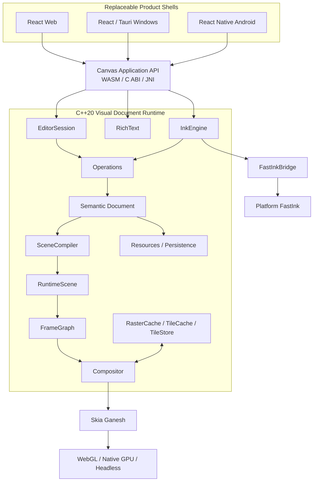

# Canvas v2 项目总体框架

> 状态：Architecture Baseline v1.0；当前阶段：POC-01 Shared Engine 设计；主路线：C++20 + Skia Ganesh + 可替换平台 Shell

Canvas v2 的正式定义是 **Visual Document Runtime**。它不是一个单纯的白板应用、Skia Renderer 或跨平台 UI 框架，而是整个产品体系共享的语义文档、编辑、笔迹、文本、场景、渲染、持久化与协作运行时。

本文档固定项目边界和不可随意漂移的架构决策。模块契约、阶段任务、验证方法和决策依据分别见：

- [系统架构](architecture/SYSTEM_ARCHITECTURE.md)
- [分阶段交付计划](planning/STAGED_DELIVERY_PLAN.md)
- [验证策略](quality/VERIFICATION_STRATEGY.md)
- [Vibe 架构研究结论](research/VIBE_ARCHITECTURE_FINDINGS.md)
- [架构决策记录](adr/README.md)

## 1. 产品定义

Canvas v2 为 Web、Windows、Android 和复用 Web Shell 的 ChromiumOS 产品提供同一套文档与画布语义。平台 UI 可以替换，核心数据与行为不能分叉。

长期能力边界包括：

- 无限画布、页面、容器、结构化布局和多视口。
- Shape、Vector、Image、PDF、Connector 和外部内容。
- Vector、Dab/Pixel 与 Hybrid Ink，以及独立低延迟 FastInk。
- RichText、Table、Sticky、Comment Anchor 和语义搜索。
- Selection、Tools、History、Clipboard、Text Edit 与 Presence。
- SceneCompiler、FrameGraph、Compositor、多级 Tile Cache。
- 本地持久化、离线编辑、多人协作、导出和 Headless 渲染。

这些能力属于架构容量，不代表全部进入 V1 实现。

## 2. V1 范围

### 2.1 V1 实现节点

- `Page`：文档根和视口/导出边界。
- `Shape`：基础几何图元与样式。
- `Image`：外部资源引用、布局和绘制。
- `VectorPath`：可编辑矢量路径。
- `RichText`：从第一版支持段落、runs、selection 和 composition。
- `VectorStroke`：保留语义中心线和笔刷参数。
- `DabStroke`：支持纹理/dab 类型笔刷，不把所有 Stroke 简化为 `SkPath`。

### 2.2 只冻结扩展边界

以下节点不进入 V1 功能实现，但类型体系、SceneCompiler、布局和资源边界不得阻止后续加入：

- `Section`、`Table`、`PDF`、`Embed`、`CommentAnchor`。
- `Video`、`ExternalSurface`、`HybridStroke`。
- 复杂权限对象、AI 对象和 Presentation 专用对象。

`Comment` 是领域对象与 anchor 的组合，不作为普通 RenderNode。`ExternalSurface` 首期验证 Overlay，不承诺纹理零拷贝。

### 2.3 V1 协作范围

V1 包含 Collaboration MVP：

- 对象操作同步、Presence、操作去重和断网队列。
- 重连、快照引导和随机交错后的基本收敛。
- 文档状态、EditorSession 和 Presence 严格分离。

复杂 RichText 冲突、企业权限、完整历史压缩和大规模会话不是 V1 阻断项，分别通过后续 ADR 处理。

## 3. 平台矩阵

| 平台 | Product Shell | Runtime 边界 | 渲染与输入 |
| --- | --- | --- | --- |
| Web | React + TypeScript | WASM API | Skia Ganesh/WebGL；DOM 只负责产品 UI |
| Windows | React + Tauri | C ABI | Native Canvas Region；产品 UI 与画布保持固定 z-order 边界 |
| Android | React Native | Native `CanvasView` + JNI | MotionEvent/历史点直接进入 C++ InputRouter，不经过 RN JS |
| ChromiumOS | 复用 Web Shell | WASM API | 平台 FastInk 能力通过独立 backend 注入 |

跨平台共享的是 Runtime，不是 UI 框架。Toolbar、Inspector、Dialog、Share、Account 和 Navigation 留在 Shell；Document、Operations、Ink、Text、Scene、HitTest、Renderer 与 Serialization 留在 C++ Runtime。

## 4. 固定总体架构



主渲染链固定为：

```text
Semantic Document
    → SceneCompiler
    → RuntimeScene
    → Visibility / Spatial Query
    → Render Tree
    → FrameGraph
    → Compositor
    → Skia Ganesh
```

Skia 是 GFX backend，不拥有 Document、Editor、Ink 或 Text 语义。Graphite/WebGPU 只能作为未来 RendererBackend，不得反向改变上层接口。

## 5. Runtime 模块

| 模块 | 权威职责 | 明确不负责 |
| --- | --- | --- |
| Document | 语义节点、层级、样式、资源引用、版本 | Skia 对象、选区、GPU 缓存 |
| Operations | 唯一持久写入口、事务、回放、协作操作 | 平台输入与绘制 |
| EditorSession | Selection、Hover、Tools、Snap、History、Clipboard | 文档持久化真相 |
| RichText | TextDocument、runs、selection、composition | 平台 IME UI |
| InkEngine | Pointer 批次、StrokeSession、笔刷语义、Canonical Stroke | 平台直接送显 |
| SceneCompiler | Document 到 RuntimeScene 的确定性增量编译 | 文档写入 |
| RuntimeScene | 布局结果、空间索引、可见性、命中查询 | 领域元数据真相 |
| FrameGraph | Pass、依赖、资源生命周期 | 工具和文档规则 |
| Compositor | Background/Content/Ink/Overlay/Selection/HUD 合成 | 文档操作 |
| TileCache | L1/L2/L3 缓存契约、预算、失效 | 权威内容存储 |
| Resources | 图片、字体、外部资源加载与版本 | 平台文件对话框 |
| Persistence | 快照、操作日志、迁移、崩溃恢复 | 网络 transport |

## 6. 状态与生命周期

五类状态必须独立：

1. **Document State**：可保存、可同步的语义事实。
2. **EditorSession State**：Selection、Hover、Tool、TextEditSession、Viewport。
3. **Collaboration Presence**：在线成员、远端光标、临时选区和连接状态。
4. **RuntimeScene State**：布局、空间索引、Render Tree 和 Dirty Region，可重建。
5. **GPU/Cache State**：纹理、display list、tile 和设备资源，可丢弃。

任何缓存或 GPU 设备丢失都不得改变 Document。Presence 不进入文件，EditorSession 不成为协作事实，Document 不保存 Skia 或平台句柄。

## 7. 核心接口基线

### 7.1 Pointer 与 Ink

`PointerSampleBatch` 批量携带 pointer ID、位置、压力、倾角、接触尺寸、时间戳、设备类型和历史样本。平台适配器负责归一化，Android 不逐点穿过 RN JS。

`StrokeSession` 同时产生：

- `Preview Stroke`：允许预测和临时质量，用于最低延迟反馈。
- `Canonical Stroke`：稳定、可编辑、可持久化并进入 Document。

二者共享 Stroke ID 和笔刷语义；Preview 结束后必须能无闪烁交接到 Canonical。

### 7.2 FastInk

`FastInkBridge/FastInkBackend` 固定提供 `begin`、`push`、`end`、`cancel`。核心不知道 DirectComposition、SurfaceControl、DRM、HWC 或硬件 plane。

- Web：使用正常 WASM Skia Preview。
- Windows/Android：实现应用级 native low-latency preview。
- 自有设备：条件式评估 Raw Input、FastInk Service、DMA-BUF/GBM 与 DRM atomic overlay，不阻塞普通应用产品路线。

### 7.3 Scene 与缓存

`SceneCompiler` 接收 Document revision/ChangeSet，生成可完整重建、可增量更新的 RuntimeScene。全量编译和相同变更序列的增量编译必须等价。

缓存接口从首版存在，能力按阶段展开：

- L1：GPU/当前进程快速缓存，V1 产品化实现。
- L2：RAM cache，性能数据证明需要时启用。
- L3：SSD/eMMC 持久 tile，仅自有设备或大文档需求驱动。

### 7.4 RichText

`TextDocument` 从第一版包含 paragraphs、runs、styles 和 attributes；`TextEditSession` 管理 selection、caret、composition、undo；`TextInputAdapter` 负责 Web、Windows 和 Android IME 边界。渲染由 TextDocument → TextLayout → SkParagraph 完成。

## 8. 工程原则

1. **Shell 可替换，Runtime 不分叉。**
2. **Document 不等于 RuntimeScene，RuntimeScene 不等于 Skia scene。**
3. **Stroke 不等于 SkPath，Preview 不等于 Canonical。**
4. **Text 是一级领域模型，不是带字符串的 Shape。**
5. **FrameGraph 和缓存接口前置，但实现复杂度按证据递增。**
6. **POC 先单线程；线程接口预留，只有剖析数据允许引入 worker。**
7. **同一操作和输入语料必须可跨平台回放。**
8. **性能数字绑定设备、场景、构建和测量方法。**

## 9. 目标仓库结构

```text
canvas/
├── core/
│   ├── foundation/
│   ├── geometry/
│   ├── document/
│   ├── operations/
│   ├── editor/
│   ├── text/
│   ├── ink/
│   ├── scene/
│   ├── frame_graph/
│   ├── compositor/
│   ├── cache/
│   ├── resources/
│   ├── persistence/
│   └── bridge/
├── platform/
│   ├── web/
│   ├── windows/
│   ├── android/
│   └── fastink/
├── shells/
│   ├── web/
│   ├── windows/
│   └── android/
├── pocs/
│   ├── shared_engine/
│   ├── ink_engine/
│   ├── scene_100k/
│   ├── text_ime/
│   ├── hybrid_surface/
│   └── fastink/
├── tests/
├── benchmarks/
├── tools/
└── docs/
```

这些目录只在对应 POC 或产品阶段开始时创建；当前文档阶段不创建空代码骨架。

## 10. 两级路线图

### 技术验证层

| 阶段 | 主题 | 阻断结果 |
| --- | --- | --- |
| POC-01 | Shared Engine | Windows Native 与 Web WASM 共享同一 C++ Runtime |
| POC-02 | Ink Engine | Pointer batch、Vector/Dab、Preview/Canonical 双路径成立 |
| POC-03 | 100K Scene | SceneCompiler、空间索引、FrameGraph、Tile 接口满足规模目标 |
| POC-04 | RichText / IME | Web/Windows/Android 文本编辑语义成立 |
| POC-05 | Hybrid Surface | Overlay 方案与 z-order 约束可行 |
| POC-06 | FastInk | 应用级低延迟预览与 Canonical 交接可行 |

### 产品化层

| 阶段 | 主题 | 核心结果 |
| --- | --- | --- |
| R1 | Runtime Foundation | 工程、模块、Bridge、诊断和确定性基础 |
| R2 | V1 Visual Document Runtime | V1 节点、Editor、Operations、RichText、Ink、Persistence |
| R3 | Production Rendering and Shells | 生产 FrameGraph/Cache 与三平台集成 |
| R4 | Collaboration MVP | 对象同步、Presence、断网重连和基本收敛 |
| R5 | Hardening and Release | 兼容、恢复、安全、性能和发布闭环 |

完整设计、验证、实现、交付物和量化退出条件见[分阶段交付计划](planning/STAGED_DELIVERY_PLAN.md)。

## 11. 已接受与待验证决策

已经接受：Visual Document Runtime 定位、三平台 Shell、Document/Scene 分离、双路径 Ink/FastInk、Ganesh v1、RichText 一级模型、缓存接口前置、POC 单线程策略。

仍需实验型 ADR：

- 文档快照与操作日志格式。
- Collaboration MVP 的具体合并算法和协议。
- L2/L3 缓存格式与压缩策略。
- POC 后的线程拓扑和 WASM pthread 启用时机。

“待验证”是明确的阶段输出，不允许实现人员在没有 ADR 和证据时自行选择。

## 12. 项目完成定义

任何 POC 或产品阶段只有同时满足以下条件才算完成：

- 设计、接口和状态所有权与本文基线一致。
- 验证语料、基准脚本和环境信息可重复。
- 阶段要求的功能从干净环境可构建、运行和演示。
- 正确性、视觉、延迟、规模与资源退出阈值全部通过。
- 新增持久状态有版本与失败恢复策略。
- 未关闭风险已登记到后续 ADR，不被代码事实偷偷固定。
