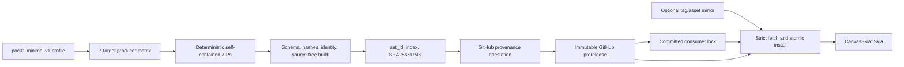

# Skia Prebuilt SDK Supply Chain

## 边界

`poc01-minimal-v1` 固定 POC-01 已验证的 Ganesh 功能集，不顺带引入 RichText、
JPEG/WebP、SVG、PDF、Vulkan、Graphite、Debug 或符号包。Producer 是唯一允许获取
Skia source 并运行 GN/Ninja 的路径；Canvas 普通 CI 是只读 Consumer。

POC-04 使用独立的
[`poc04-richtext-v2`](../../tools/skia/profiles/poc04-richtext-v2.json) profile。
它在保留既有 Web、Windows 和
Android RichText SDK 的基础上，增加 `macos-arm64-metal`、`ios-arm64-metal` 和
`ios-simulator-arm64-metal`。iOS device SDK 同时服务 iPhone 与 iPad，iOS
simulator SDK 同时服务 iPhone 与 iPad simulator；这些是 SDK producer 和
source-free linking 门禁，不等同于 AppKit/UIKit IME 行为验收。



## Profile 与 identity

[`poc01-minimal-v1.json`](../../tools/skia/profiles/poc01-minimal-v1.json)
定义公共 GN 参数、七个 target、实际链接的 archive 和 toolchain 最低身份约束。
target ID 固定为：

- `windows-x64-d3d12`
- `web-wasm-webgl2`
- `macos-arm64-metal`
- `ios-arm64-metal`
- `ios-simulator-arm64-metal`
- `android-arm64-v8a-gles3`
- `android-x86_64-gles3`

`sdk_id` 是规范化 identity JSON 的 SHA-256。identity 包含 profile/hash、Skia
commit、target/backend/arch、规范化 GN 参数、实际 toolchain identity 和 producer
recipe hash；绝对安装路径不参与。`set_id` 是按 target ID 排序后的
`target -> sdk_id` 映射的 SHA-256。

Windows manifest 记录 LLVM、实际 MSVC toolset 与 Windows SDK；Web 记录
Emscripten/LLVM 与无 pthread；Apple 记录 Xcode、SDK 版本和 iOS 17.0 deployment
target；Android 记录 NDK 27.2.12479018 与 API 26。

## 包契约

每个 `skia-sdk-<target>.zip` 根目录包含：

```text
manifest.json
args.gn
include/**
modules/skcms/{skcms.h,src/skcms_public.h}
lib/*.{a,lib}
lib/cmake/CanvasSkia/CanvasSkiaConfig.cmake
resources/fonts/Roboto-Regular.ttf
licenses/{Skia,FreeType,libpng,zlib}.txt
```

Manifest 对所有 payload 文件记录角色、大小和 SHA-256。ZIP 使用固定时间戳、排序
路径和固定权限生成；连续两次打包必须逐字节一致。验证器拒绝未知 schema 字段、重复
或穿越路径、符号链接、额外/缺失文件、校验漂移、错误 target/toolchain、无效静态库和
不匹配的字体。

## 发布权限和不可变性

[`skia-sdk-producer.yml`](../../.github/workflows/skia-sdk-producer.yml) 在相关 PR
上以 `contents: read` 并行构建、打包和验证七个 target。Actions artifact 只负责
matrix 与聚合 job 之间的短期传递。

从 `main` 人工触发时会重新构建，而不是提升 PR artifact。聚合 job 要求七包齐全，
生成 `skia-sdk-index.json` 与 `SHA256SUMS`。publish job 单独获取写权限，为 ZIP 与
index 生成 provenance，然后创建
`skia-sdk-poc01-minimal-v1-<set_id 前 16 位>` prerelease。若同名 Release 已存在，
只有 target commit、资产集合和每个字节都一致才成功；任何差异都失败且不会覆盖资产。

首个不可变 prerelease 已发布为
`skia-sdk-poc01-minimal-v1-debcbb7b9376806c`，完整 set ID 为
`debcbb7b9376806c94ffb9af5950ebd8a6de0547833f9b57df96a20531ca7817`。
[`skia-sdk.lock.json`](../../skia-sdk.lock.json) 固定 Release repository/tag、profile、
Skia commit，以及七个资产的 SDK ID、大小、SHA-256 和 toolchain identity。被任何
lock 引用的 Release 永不删除；回滚只恢复旧 lock。

## Consumer 下载与 CMake 边界

[`fetch.py`](../../tools/skia/fetch.py) 默认从 lock 指定的精确 GitHub Release tag
下载。设置 `CANVAS_SKIA_SDK_BASE_URL` 时，镜像必须暴露
`<base>/<tag>/<asset>`；无论来源，下载器都执行相同的大小、SHA-256、ZIP 安全、
manifest、文件级 hash、target、toolchain、profile 与规范化 GN identity 校验。
验证在临时目录完成，成功后才原子替换 `.deps/skia-sdk/<target>`；已有安装在复用前
也会重新验证。

普通构建通过 `CANVAS_SKIA_SDK_ROOT` 和
`find_package(CanvasSkia CONFIG REQUIRED)` 只链接 `CanvasSkia::Skia`。CMake 同时
比对安装 manifest 与 committed lock；缺包或不匹配直接失败并给出 `fetch.py` 命令，
没有源码回退。普通 POC-01 workflow 的静态检查拒绝 Skia source bootstrap、sync、
`skia/out` cache 和 producer builder。七个 SDK 的 ID/下载字节/耗时与 Canvas 构建、
测试耗时写入 job summary；当前只收集数据，不设总耗时门禁。

更新 lock 只能显式运行：

```sh
python3 tools/skia/update_lock.py --tag <immutable-prerelease-tag>
```

该命令会核对 prerelease、target commit、index、`SHA256SUMS`、GitHub 资产 digest 和
精确七包资产集合后才改写 lock。
