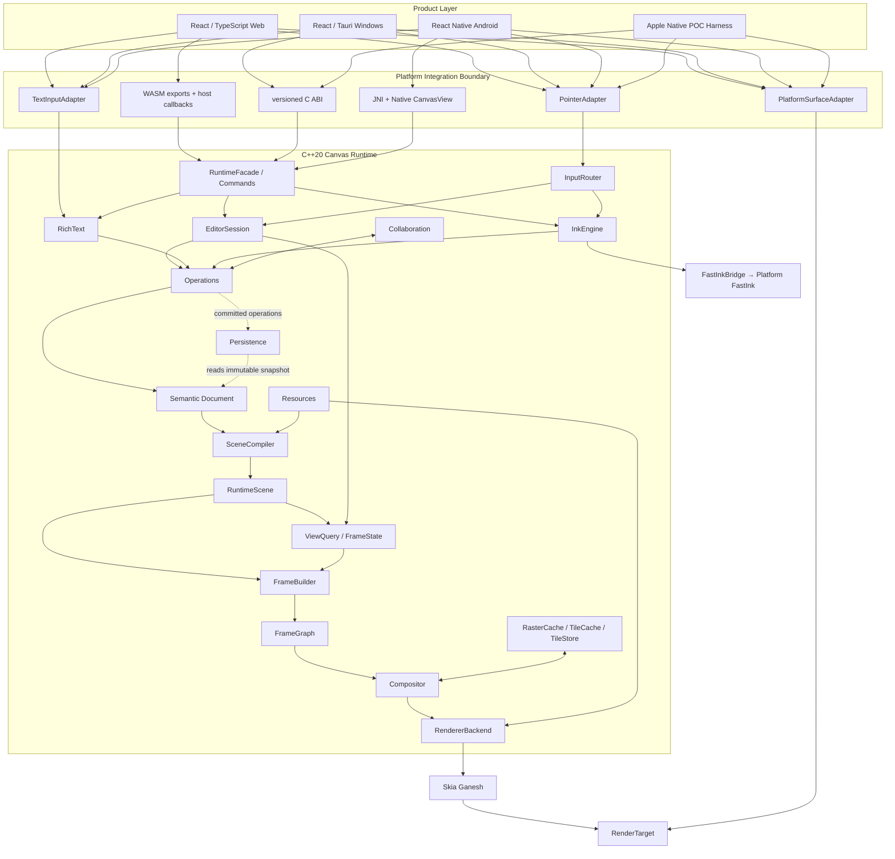
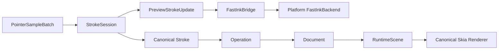

# Canvas v2 系统架构

> 状态：Accepted Baseline；适用范围：POC-01 至 R5；相关 ADR：[ADR 索引](../adr/README.md)

本文档定义 Visual Document Runtime 的模块边界、数据流和接口语义。具体容器、序列化库、协作算法和最终线程拓扑仍由对应 POC/ADR 决定，但实现不得绕过这里规定的所有权和依赖方向。

## 1. 系统分层



依赖只能自上而下：Shell 的低频产品命令依赖 Application API；Pointer 与 IME 分别通过专用 adapter 进入 InputRouter 和 TextEditSession。Bridge 依赖 Runtime 的公开 facade，Document 不依赖 Editor、ResourceManager、Persistence、Skia、网络或平台，Renderer 不拥有 Document 写入口或平台 surface 生命周期。

## 2. 平台边界

### 2.1 Web

- React/TypeScript 负责 Toolbar、Inspector、Dialog、Comment UI、Share、Account 和 Navigation。
- C++ Runtime 编译为 WASM，通过窄接口接收命令、批量输入和平台服务回调。
- Skia Ganesh 使用 WebGL；POC 阶段单线程运行，不启用 SharedArrayBuffer/pthread。
- Web adapter 拥有 HTML Canvas/WebGL context 的创建、resize、context loss 与 present；Runtime 只消费本帧 `RenderTarget`。
- HTML/DOM 不插入 RuntimeScene 的任意深度。ExternalSurface 只通过受控 Overlay 层出现。

### 2.2 Windows

- React/Tauri 负责产品 UI，C++ Runtime 在 native canvas region 中绘制。
- C ABI 版本化，使用不透明 handle；C++ 对象、STL 容器和异常不跨 ABI。
- Windows adapter 拥有 HWND、DXGI swapchain/backbuffer、resize、present 与 device-loss 生命周期；这些类型不进入 Runtime Core。
- DOM/WebView2 与 native canvas 使用固定层级区域，不允许单个 DOM 元素穿插在画布对象之间。
- Pen/Pointer 输入由 native region 收集并批量进入 InputRouter。

### 2.3 Android

- React Native 只负责产品 Shell。
- Native `CanvasView` 拥有 Surface 生命周期、MotionEvent、历史点、IME 桥和 JNI 调用。
- 触控笔数据链固定为 `MotionEvent/history → Native CanvasView → PointerSampleBatch → C++ InputRouter`，不得走 RN event/JS/NativeModule 往返。
- JNI 只传递 opaque handle、批量结构、命令和事件；高频路径不得逐 sample 跨 JNI。

### 2.4 Apple POC

- macOS/iOS/iPadOS adapter 拥有 native view、CAMetalLayer/Metal drawable、resize、前后台与 drawable failure 生命周期。
- Apple 平台在 POC-01 只验证共享 Runtime 与 Ganesh/Metal；产品 Shell 和正式平台 API 另行 ADR。

### 2.5 ChromiumOS 与自有设备

- ChromiumOS 默认复用 Web Shell 和 WASM Runtime。
- 系统 FastInk 是平台能力，通过 FastInkBackend 注入；Runtime 不依赖 ChromiumOS、Android BSP 或 DRM 类型。
- 自有设备预研可以拥有 RawInputSource 和 system service，但它们不进入通用 Runtime target。

## 3. 权威状态边界

### 3.1 Semantic Document

Document 是唯一可保存、迁移和协作同步的业务真相，包含：

- Document/Page identity、schema version 和 capability flags。
- V1 节点、稳定 ID、层级、z-order、几何、样式和资源引用。
- RichText 内容、Vector/Dab Stroke 的语义数据。
- 操作与迁移需要的最小版本/因果元数据。

Document 不包含：Skia 对象、GPU handle、空间索引、选区、hover、IME composition UI、远端光标或连接状态。

### 3.2 EditorSession

每个本地视图拥有独立 EditorSession：

- Viewport、Selection、Hover、Tool、Snap 和临时 Drag state。
- History/Undo intention、Clipboard session 和 TextEditSession。
- Active Stroke session 与局部 preview 状态。

EditorSession 可根据产品需要局部恢复，但不作为 Document collaboration state。

### 3.3 Collaboration Presence

Presence 包含在线成员、远端光标、临时选区、follow 状态和网络质量。它允许丢失和过期，不进入快照、操作历史与撤销语义。

### 3.4 RuntimeScene

RuntimeScene 是 SceneCompiler 从 Document 构建的派生表示：

- 布局结果、world bounds、空间索引、render/hit-test records。
- 文本布局引用、稳定资源引用/解析状态和 world-space content invalidation。
- 可由主画布、minimap、第二窗口和 headless export 共享的稳定 scene data。

RuntimeScene 可随时全量重建；增量更新结果必须与同 revision 的全量编译等价。

RuntimeScene 不保存 Viewport、单视口 visible set/clip/LOD、scale bucket、screen-space damage、Selection、Hover、HUD、Presence 或 Active Stroke Preview。这些由 `RuntimeScene + EditorSession/View + target parameters` 产生单视口 `ViewQuery/FrameState`，并按 view/frame 独立失效。

### 3.5 View/Frame State

`ViewQuery/FrameState` 是单视口、单 target 的短暂派生状态，包含 visible records、viewport clip、LOD/scale bucket、target color/DPR、screen-space damage 和 frame revision。Selection、Hover、caret、HUD、Presence 与 Active Preview 作为独立 overlay 输入，不回写 RuntimeScene。

### 3.6 GPU 与缓存

display list、纹理、字形、图片、raster tile 和 persistent tile 都是非权威数据。设备丢失、缓存逐出或版本不兼容时直接重建，不允许回写或修正文档语义。

## 4. 领域模型

### 4.1 V1 节点

```text
Page
├── Shape
├── Image
├── VectorPath
├── RichText
├── VectorStroke
└── DabStroke
```

所有节点具有稳定 ID、局部变换、可见/锁定状态、稳定排序键和版本化属性集合。V1 的 `Page` 是语义内容根，可声明内容/导出边界，但不是 Viewport。Viewport 始终属于 `EditorSession`。V1 不允许一般节点拥有跨 Page 的隐式父子引用；`Document` 长期采用单 Page 还是 `DocumentRoot → Page*`，由 R2 schema/migration ADR 在产品语义明确后决定。

### 4.2 扩展类别

```text
Structural: Section / Frame / Group / Table / Sticky
Graphics:   PDF / Connector
Ink:        HybridStroke
Domain:     Comment + Anchor
External:   Embed / Video / ExternalSurface
```

V1 不实现这些节点，但 extension registry、资源引用、SceneCompiler visitor 和 unknown capability 处理必须允许未来添加。未知必需能力要显式拒绝，不能静默降级为丢失内容。

## 5. Operations

三个层次不能混用：

- **Intent/Command**：用户意图，例如移动当前选区或提交一次文本 composition。
- **Operation**：已规范化、可回放、可持久化、可同步的确定性变化。
- **ChangeSet**：Operation 应用结果，描述受影响节点、字段、资源、布局和 dirty hints。

本地写路径：

```text
Normalized Input
  → Editor/Text/Ink intent
  → command validation
  → deterministic Operation
  → Document transaction
  → ChangeSet
  → persistence/collaboration queue
  → SceneCompiler incremental update
```

远端写路径从 operation validation 开始，不能进入 Tool state machine。Document 只提供一个有序写入口；同一初始快照和 operation sequence 必须得到相同逻辑摘要。

## 6. Pointer 与 Ink 接口

以下是必须保持的语义接口；具体二进制布局由 POC-02 固定。

```cpp
struct PointerSample {
  PointerId pointer_id;
  Vec2 position;
  float pressure;
  Vec2 tilt;
  Vec2 contact_size;
  Timestamp timestamp;
  PointerPhase phase;
};

struct PointerSampleBatch {
  PointerDeviceInfo device;
  Span<const PointerSample> samples;
};
```

要求：

- 一个 batch 内按时间单调排序；跨 batch 的乱序策略由 InputRouter 明确处理。
- 平台 timestamp 进入 Runtime 前转换为同一单调时间域。
- 缺失 pressure/tilt 使用 capability 标记，不伪造硬件精度。
- 历史点批量传递，不逐点跨 WASM/C ABI/JNI。

`StrokeSession` 生命周期：

```cpp
class StrokeSession {
 public:
  void push(const PointerSampleBatch& batch);
  StrokeCommit end();
  void cancel();
};
```

- Session 允许 resample、smooth 和 prediction。
- Preview 可以包含预测点，Canonical 只能提交确认样本派生的稳定语义。
- `end()` 生成一次原子 Stroke operation；`cancel()` 不留下 Document 修改。
- Preview 与 Canonical 共享 Stroke ID、transform 和 brush descriptor。

## 7. FastInk 双路径



接口语义：

```cpp
class FastInkBackend {
 public:
  virtual void begin(const FastInkDescriptor&) = 0;
  virtual void push(const PreviewStrokeUpdate&) = 0;
  virtual void end(StrokeId) = 0;
  virtual void cancel(StrokeId) = 0;
};
```

- `PreviewStrokeUpdate` 是 `StrokeSession` 在统一 resample/smooth/pressure/prediction/rollback 后产生的版本化 Preview Model，至少携带 Stroke ID、update revision、brush descriptor、transform/坐标空间、confirmed representation、predicted tail 和 replace/truncate 语义。
- 具体 vector segment/dab batch 布局、buffer ownership 和 ABI 由 POC-02 用延迟与回放证据冻结；平台 backend 不接收 raw pointer sample 来重新实现另一套平滑、预测或笔刷解释。
- `begin/push/end/cancel` 必须按 Stroke ID 幂等保护。
- `end` 只结束 Preview；Canonical 是否提交由 StrokeSession/Operations 决定。
- Canonical 首帧可见后，Preview 才能移除；失败时保留或安全淡出，不出现空白帧。
- 通用 Runtime 不引用 DirectComposition、SurfaceControl、DRM、HWC、DMA-BUF 或 plane 类型。

设备级预研分层为 `RawInputSource → FastInk Service → PreviewStrokeRenderer → ScanoutBuffer → DisplayPlane`。该 target 需要受控硬件、系统权限和 BSP，不是普通 App fallback。

## 8. RichText 与 IME

```text
Platform IME
  → TextInputAdapter
  → TextEditSession
  → TextDocument
  → TextLayout
  → SkParagraph
```

`TextDocument` 包含 paragraphs、runs、styles 和 attributes；`TextEditSession` 包含 selection、caret、composition 和 undo grouping。平台 composition 未提交前属于 session，提交后通过 Operation 进入 Document。

`TextInputAdapter` 必须表达：

- begin/update/commit/cancel composition。
- selection 与 caret 查询/更新。
- surrounding text 和 replacement range。
- clipboard、快捷键和平台文本服务请求。

Web、Windows、Android 运行同一文本行为语料；平台只能适配 IME，不得复制 RichText 模型。

## 9. SceneCompiler 与渲染管线

`SceneCompiler` 提供两个逻辑入口：全量 `compile(DocumentSnapshot)` 与增量 `apply(ChangeSet)`。二者输出相同 revision 的 RuntimeScene 时，render records、bounds、hit-test 和视觉结果必须等价。Document 只携带稳定 `ResourceId/ResourceRef`；SceneCompiler 通过只读 `ResourceResolver` 获取状态，不让 Document 调用或拥有 ResourceManager。

共享 Scene 和单视口/临时状态进入以下管线：

1. `RuntimeScene + Viewport` 通过 SpatialIndex 查找候选并生成单视口 `ViewQuery/FrameState`。
2. Visibility、clip、LOD 和 screen-space damage 过滤本帧内容。
3. Render Tree 解析层级、opacity、mask 和 effect 边界。
4. `FrameBuilder` 合并 RuntimeScene、FrameState、Editor/Presence overlays、Active Preview 和 ExternalSurface placement，生成不可变 frame plan。
5. FrameGraph 构建 Background、Content、Ink、ExternalSurface、Overlay、Selection、HUD passes。
6. Compositor 分配 pass 资源并应用 cache。
7. RendererBackend 使用 Skia Ganesh 绘制到调用方提供的 `RenderTarget`。

FrameGraph 管理 pass 依赖和临时资源，不拥有文档语义。RendererBackend 接口要允许未来 Graphite，但 V1 只验收 Ganesh。

### 9.1 RenderTarget 与 PlatformSurfaceAdapter

`PlatformSurfaceAdapter` 位于平台边界，拥有 HTML Canvas/WebGL context、HWND/DXGI swapchain、Android Surface/ANativeWindow/EGLSurface、CAMetalLayer/Metal drawable 或 Headless surface。它负责 acquire/resize/present/recover，并为每帧提供带尺寸、DPR、颜色空间、backend capability 和 generation 的 `RenderTarget`。

`RendererBackend` 属于 C++ Runtime 渲染能力，只消费 frame plan 和有效 RenderTarget。它不能缓存或销毁 native window/view handle，也不能假设 target 跨 resize、device/context loss 后仍有效。具体平台类型只允许出现在 platform adapter 实现中。

## 10. Cache 接口

```cpp
class RasterCache;
class TileCache;
class TileStore;
```

- `RasterCache`：对象或 subtree 的可丢弃 raster 结果。
- `TileCache`：按 viewport/scale/content revision 管理 L1/L2 tile。
- `TileStore`：可选 L3 持久 tile，必须包含版本、内容摘要和兼容信息。

缓存 key 至少覆盖内容 revision、渲染参数、scale bucket、颜色空间和 backend capability。任何无法证明有效的缓存项必须 miss，不允许展示过期内容。

演进顺序：POC-03 验证接口与 L1 原型；R3 产品化 L1；L2/L3 只有在性能证据和 ADR 通过后实现。

## 11. Hybrid Surface

POC-05 固定使用 Overlay：

- RuntimeScene 保存 ExternalSurface 的语义 bounds、clip、opacity 和稳定 `ExternalSurfaceId`；native view/surface handle 只存在于 Platform Shell/adapter。
- Platform Shell 创建并定位 WebView/Video surface。
- Compositor 输出 overlay placement，不把外部 surface 当 Skia texture。
- Overlay 只允许位于约定 pass；不支持任意外部 UI 穿插到每个 Document node 之间。

Texture import、zero-copy、复杂 mask/effect 与跨平台一致混合留给未来 ADR。

## 12. Resources 与 Persistence

- Document 只保存稳定 `ResourceId/ResourceRef`、内容 hash 和必要语义元数据，不依赖 ResourceManager、平台文件 API 或 Persistence。
- Resources 负责 resolve、decode、版本、placeholder、CPU/GPU upload 协调；资源失败只能产生诊断和派生状态，不能反向修改 Document。
- Persistence 作为服务保存 Document snapshot、operation log、resource manifest 和 blobs，并负责 migration/crash recovery；Document 本身不发起 IO。
- Resources 与 Persistence 可以共享 blob/content-addressed storage 接口，但生命周期和模块所有权保持独立。

## 13. Collaboration MVP

Collaboration 只传输 Operation 和独立 Presence：

- 本地 Operation 乐观应用后进入 durable outbound queue。
- 远端 envelope 先做版本、大小、身份、去重和算法校验，再进入单一 Document 写入口。
- 断网允许继续产生 Operation；重连通过 server acknowledgement、缺失操作或快照引导恢复。
- Presence 可节流、丢失和过期，不影响文档收敛。

具体 CRDT/OT/排序日志方案由 R4 前的实验型 ADR 决定。V1 退出门禁只覆盖对象操作和基础 RichText 原子操作，不承诺字符级复杂并发编辑。

## 14. 线程模型

POC-01 至 POC-06 默认在 canonical deterministic executor 上单线程有序执行 Document write、SceneCompiler 和 Canonical Renderer，以建立确定性参考结果。接口需传递 revision、不可变 snapshot 和任务取消信息，但不提前创建 Runtime worker。

平台原始输入采集、OS compositor、GPU driver，以及 POC-06 FastInkBackend 必需的平台 presentation thread 不属于该 executor。它们与 canonical Runtime 的通信必须通过显式 queue、revision、generation、ack/fence、cancel 和销毁契约；这项豁免不代表产品线程拓扑已经确定。

后台资源解码、IO、Scene Worker、Render Thread、Cache Worker 和 WASM pthread 只有在：

1. 基准证明单线程未达到阶段预算；
2. 数据所有权与 revision 失效规则已有测试；
3. 新线程拓扑 ADR 被接受；

之后才能进入产品实现。GPU 资源始终在所属 context/thread 创建与销毁。

## 15. 失败与恢复

- Bridge 版本不兼容：初始化失败并返回结构化能力差异。
- Surface/设备丢失：销毁 GPU/cache state，从 RuntimeScene 重建，不影响 Document。
- FastInk backend 失败：关闭 preview path，继续 Canonical Renderer。
- 资源加载失败：Document 保留引用，RuntimeScene 输出明确 placeholder/diagnostic。
- Scene 增量校验失败：记录 revision，回退全量 compile。
- 文件或远端操作损坏：在 Document transaction 前拒绝，不产生部分修改。
- IME/手势取消：清理 session 临时状态，不产生 Operation。

## 16. 架构不变量

- Shell 不拥有 Document 业务真相。
- Document 不依赖 Skia、平台或网络。
- Document 只保存资源引用，不依赖 ResourceManager 或 Persistence。
- RuntimeScene 可由 Document 完整重建。
- RuntimeScene 不拥有 per-view visible set、screen damage 或 Editor overlay。
- Renderer 和 cache 无 Document 写入口。
- RendererBackend 不拥有平台 window/view/surface 生命周期；PlatformSurfaceAdapter 不拥有 Document 语义。
- FastInk 失败不阻断 Canonical Stroke。
- FastInkBackend 消费共享 Preview Model，不重新定义 Stroke 平滑、预测或笔刷语义。
- Android 高频 pen path 不经过 RN JS。
- POC 参考结果在引入多线程后继续作为等价性 oracle。
- 所有平台共享 operation、input replay、text behavior 和 golden scene 语料。
