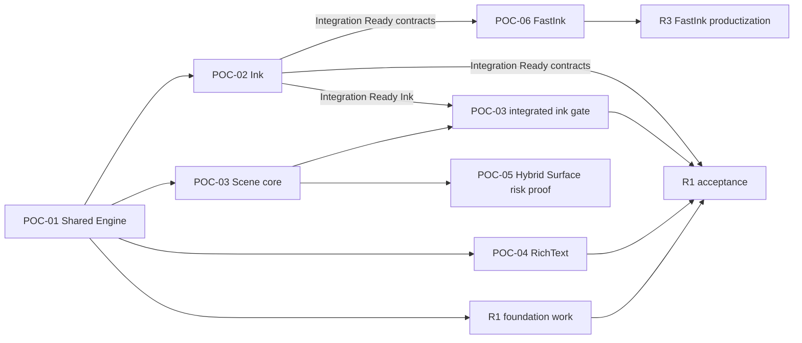

# Canvas v2 分阶段交付计划

> 状态：Accepted Delivery Baseline；当前阶段：POC-02 Integration Ready / Validating，POC-03 已解除启动阻塞；原则：按证据依赖 DAG 验证高风险边界，产品化不得越过其实际依赖

路线图分为技术验证层 POC-01～06 和产品化层 R1～R5。编号表达工作包，不表达无条件串行关系；设计、实现和验收遵循以下 evidence DAG：

POC-02/03/04 的核心工作可在 POC-01 后并行。POC-02 达到 `Integration Ready / Validating` 后，POC-03 integrated ink gate、POC-06 和 R1 foundation 可以消费其实验性契约，无需等待 POC-02 最终延迟验收；POC-02 的规模性能由 POC-03 integrated ink gate 联合验证，平台级低延迟 Preview 由 POC-06 验证。R1 工程准备可在证据收集期间进行，但 R1 acceptance 仍要求依赖图中的功能、规模与产品门禁全部满足。POC-05 是非 V1 的未来能力风险验证，不阻塞 R1/V1；POC-06 可与 R1 并行，但在通过前阻塞 R3 FastInk 产品化。任何未通过 POC 的接口都不能因并行开发或合并而被提前视为稳定产品契约。

每个性能结果必须记录设备、系统、编译器、构建模式、Skia commit/backend、场景版本、分辨率和采样方法。下文阈值是当前门禁；如基准设备变化，只能通过 ADR 修订。

## 阶段状态

- `Not started`：没有形成阶段契约。
- `Designing`：接口、语料、基准和失败模式正在冻结。
- `Validating`：用可丢弃 POC 获取证据。
- `Implementing`：POC 已通过，正在构建产品实现。
- `Accepted`：全部退出条件有可重复证据。
- `Rejected`：假设被推翻，必须 ADR 记录替代路线。

`Integration Ready` 不是新的终态，而是可与 `Validating` 并存的非终态集成资格：表示已列明的功能、确定性和契约证据足以解除下游实验阻塞，但尚未满足该 POC 的全部退出条件。它不等于 `Accepted`，不冻结产品 ABI，也不允许删除或降低剩余门禁。

# 第一层：技术验证

技术验证共享 ADR-0016 的数值/摘要契约，并从 POC common foundation 获得可注入的
deterministic clock、domain-separated seed/PRNG 与 task executor。所有 replay/generator
保存 algorithm version 与 seed；wall clock、平台随机源、线程调度和容器迭代顺序不得进入
semantic digest。ADR-0017～0019 分别在首次消费帧调度、输入队列和增量 Scene 的 POC 中
形成可执行 contract tests，而不是等到 R1 才首次定义。

## POC-01 — Shared Engine

### 目标

证明同一份单线程 C++20 Runtime 能在 Web/WASM、Windows、macOS、iOS、iPadOS 与 Android 上运行，并用 Skia Ganesh 绘制一致的最小语义场景。Apple 和 Android 的加入用于验证 Runtime 可移植性，不在 POC-01 冻结新的产品 Shell。

### 设计

- 定义最小 `CanvasRuntime` facade、opaque runtime/document/view handles 和 host callbacks。
- 定义 WASM API 与版本化 C ABI 的错误、字符串、数组、所有权和生命周期规则。
- 定义最小场景：Page、Rect/Shape、Image、VectorPath、只读 Text。
- 定义固定坐标、颜色空间、DPI、资源、字体和逻辑摘要格式。
- 应用 ADR-0016 的 canonical binary32、finite-only、canonical zero、little-endian digest
  和 checked overflow；POC-01 继续使用固定 sRGB fixture，但不据此决定 V1 产品色彩范围。
- POC fixture 使用 Page/World、View Logical 与 Device Pixel 的显式元数据；固定 DPR 1 只用于 POC-01 golden，不替代 ADR-0012 的长期坐标契约。
- 定义单线程 event loop：command → document → scene → frame。
- 定义 WebGL2、D3D12、Metal 和 Android GLES3 `PlatformSurfaceAdapter`；adapter 拥有 native surface/context 的 acquire/resize/present/recover，平台句柄不得进入通用 Runtime 或 `RenderTarget` 公共契约。
- 选择并登记 Windows/Web 基准设备与浏览器，作为 POC-01～03 性能基线；Apple/Android 记录验证设备但不替代该性能基线。

### 验证

- 同一 scene fixture 在 Web、Windows、macOS、iOS、iPadOS、Android 加载后，Document digest 必须逐字节一致。
- 使用同一打包字体、图片和 viewport 生成黄金图；至少 99.9% 像素的每通道差值 ≤ 2，其余差异必须有 diff 产物。
- create/move/delete 操作回放 10 次，digest 和 operation sequence 全部一致。
- 从两个独立空 Document 应用相同 create/move/delete sequence，最终 revision/sequence/
  digest 一致，证明 POC Core 由 Operation 驱动；本阶段不实现正式 DocumentSnapshot codec。
- x64、arm64、WASM 对 `-0/+0`、NaN/Infinity、极端 finite 值和溢出 transaction 的接受/
  拒绝结果一致；拒绝不产生部分修改。
- 连续创建/销毁 runtime、document、view 100 次，sanitizer/浏览器控制台无泄漏错误或 use-after-free。
- Release 构建连续渲染 1,000 节点 60 秒，不出现崩溃、无限增长和单帧 > 100 ms。
- Web 构建不得要求 SharedArrayBuffer、COOP/COEP 或 pthread。
- Apple runner 必须在 macOS、iPhone simulator 和 iPad simulator 分别完成 Metal render/readback；Android 必须通过 Native CanvasView/JNI 完成 render/readback，数据面不经过 JS。

### 实现

- 建立可丢弃的 C++20/Skia Ganesh POC target。
- 实现最小 Document、Operations、SceneCompiler 和 Renderer 直通链。
- 实现 Windows/D3D12、Web/WASM/WebGL2、macOS/iOS/iPadOS/Metal 与 Android Native CanvasView/JNI/GLES3 surface。
- 实现最小 C ABI、WASM exports、host callback 和结构化错误。
- 实现场景 fixture、逻辑 digest、操作回放和黄金图导出工具。

### 交付物

- Windows demo、Web demo、macOS runner、iOS/iPadOS universal runner、Android Native CanvasView demo 和相同场景资源。
- ABI/WASM 契约说明、运行脚本、构建环境锁定信息。
- Document digest、黄金图 diff、生命周期和 smoke 性能报告。
- POC-02 可复用的输入和 view/surface 边界。

### 退出条件

- [ ] Web、Windows、macOS、iOS、iPadOS 与 Android 从干净环境构建成功。
- [ ] 跨平台 Document digest 100% 一致。
- [ ] 数值边界语料在 x64/arm64/WASM 上得到相同 canonical result/error 和 digest。
- [ ] 独立空 Document 的相同 Operation replay 得到相同 revision/sequence/digest，且没有
  Shell/Scene 直接修改 Document 的旁路。
- [ ] 黄金图达到 99.9%/通道差值 2 门禁。
- [ ] 100 次生命周期测试和 60 秒 smoke 测试通过。
- [ ] Runtime 内没有平台 UI、pthread 或产品业务依赖。

## POC-02 — Ink Engine

> 当前结论：**Integration Ready / Validating**。POC-03 integrated ink gate、POC-06 和 R1 foundation 已解除启动阻塞；延迟、正式真机 Human Ink Gate 和联合规模性能仍是 Pending，不因分支合并而视为通过。

### 目标

证明独立 InkEngine 能消费批量历史点，生成 Vector/Dab 笔迹，并同时驱动低延迟 Preview 与稳定 Canonical Stroke。这是完成 POC-01 后的最高优先级。

### 设计

- 冻结 `PointerSample`、`PointerSampleBatch`、device capability 和单调 timestamp 契约。
- 定义 resample、smooth、pressure mapping、prediction 和 prediction rollback 次序。
- 应用 ADR-0016 的 canonical binary32、finite-only、canonical zero、checked overflow 和
  算法精度/舍入契约；POC common foundation 提前提供 deterministic clock、domain-separated
  seed/PRNG 和 task executor，不等待 R1。
- 定义 `StrokeSession` 的 begin/push/end/cancel、Stroke ID 和 brush descriptor。
- 定义版本化 `BrushDescriptor`：brush type/version、semantic parameters、资源身份与跨平台 replay/升级规则。
- 为 Dab/texture brush 定义版本化 PRNG 与按 algorithm/brush-version/StrokeId/stream 分域的
  seed；禁止 wall clock/全局 random 影响 Canonical Stroke。
- 决定 Vector/Dab Canonical Stroke 为长期重放需要保存的稳定表示：中心线/语义参数、版本化算法输入、稳定 geometry/dabs 的组合，以及未知 brush version 的拒绝/迁移策略。
- 定义 `push()` 增量 Canonical candidate 与 `end()` 原子 Document commit 的边界，避免长笔迹抬笔时集中计算。
- 定义 VectorStroke 的语义中心线与 DabStroke 的 dab/纹理参数。
- 定义 Preview/Canonical 共享数据、差异容差、抬笔交接和失败 fallback。
- 定义版本化 `PreviewStrokeUpdate`：confirmed/predicted 表示、revision、坐标空间和 replace/truncate 语义；平台 Preview sink 不重新解释 raw samples。
- 定义 `DefaultPreviewSink`，使用普通 Skia Canvas overlay 验证 Preview Model，不依赖 POC-06 平台低延迟 surface。
- 定义输入录制格式和设备无关回放语料。
- 定义 View Logical→Page/World 输入逆变换、ViewId/viewport revision 绑定，以及 zoom/pan/DPR 变化时的 batch 规则。
- 按 ADR-0018 定义 confirmed-input queue、兼容 batch 合并、Preview revision coalescing、
  predicted-tail replacement、容量/字节/age 上限和 `InputOverrun` 原子取消。
- 按 ADR-0017 定义 frame invalidation 与平台 VSync scheduler 边界；input、Preview 和 render
  cadence 解耦，Canonical handoff 使用 visible acknowledgement。
- 冻结 pen/touch/hover/barrel/eraser-tip/palm capability taxonomy 与 Platform/InputRouter
  arbitration ownership；只冻结 whole-stroke/segment/pixel-dab Eraser 扩展边界，不扩大
  POC-02 最小实现范围。

### 验证

- 回放鼠标、120/240 Hz 笔输入、批量历史点、pressure 缺失、时间戳间隙和 cancel 语料。
- 60 秒 240 Hz 输入流不得丢失、重复或重排已确认 sample。
- 覆盖 32+ historical sample burst、慢 Preview/render consumer、暂停/恢复与容量边界；成功
  Stroke 的 confirmed samples 100% 完整、queue age 不随书写时长增长，过载只允许明确
  `InputOverrun` 且 Document 无部分 Stroke。
- 同一录制在 Windows/Web 重放后，Canonical Stroke digest 100% 一致。
- Pointer replay 产生 Canonical AddStroke Operation；在新的空 Document 中重放后 Stroke/
  Document digest 与原路径一致，InkEngine 不直接修改 Scene 或 Document internals。
- x64、arm64、WASM 覆盖 `-0/+0`、subnormal、舍入边界、非有限值、极端坐标和矩阵溢出；
  semantic digest 逐字节一致，非法输入整笔拒绝。
- Vector/Dab 各覆盖直线、急转、慢写、快速长划和压力渐变黄金图。
- 基准设备上 input sample 到 Preview 可见的 absolute baseline 为 p95 ≤ 16.7 ms、p99 ≤
  33.3 ms；同时记录 refresh rate、display intervals、sample-to-visible frame count、p50/p95/
  p99/max 和 missed presentation。高刷设备另以 frame count/Human Ink Gate 判断，不把
  16.7 ms 宣称为所有设备的一帧目标。
- Pointer up 到 Canonical 接管不超过 2 帧，期间没有空白帧或重复深色叠加。
- prediction 错误时 Preview 能回退，Canonical 不包含未确认预测点。
- 30 秒长笔迹在 pointer up 后的 Canonical commit p95 ≤ 16.7 ms；主要 geometry/dab 处理必须在 push 阶段增量完成。
- DPR 1/1.25/1.5/2/3、非整数 zoom、pan 与 viewport revision 变化语料中，Pointer replay 的 world-space Canonical digest 一致，失效/不可逆 transform 明确拒绝。
- BrushDescriptor version/resource 改变必须影响 Stroke digest；未知必需 brush version 明确拒绝，不能静默用当前算法重绘。
- 相同 replay/seed 的 Dab variation 和 Preview revision 序列完全一致；改变 algorithm、brush
  version、StrokeId 或 stream domain 必须得到可解释且互不耦合的随机流。
- burst frame invalidation 只保留有界 callback；resize/background/device loss 后旧 target
  generation 不 present，最新 Stroke revision 最终可见。
- 在 Windows/Web/Android 代表性实机输入环境运行 Human Ink Gate：慢写、快速长划、急转、画圈、压力渐变和连续书写；主观评分必须关联同次 trace、frame pacing、prediction correction 与 handoff 证据，不能替代量化门禁。

### 实现

- 实现平台 batch 适配、InputRouter 和输入录制/回放。
- 实现有界 input/Preview queues、revision coalescing、backpressure/overrun 诊断和测试用
  PlatformFrameScheduler；不在 POC 中固定最终产品线程拓扑。
- 实现独立 InkEngine、StrokeSession、resampler、smoother 和 predictor。
- 实现增量 Canonical candidate builder 和版本化 BrushDescriptor dispatch。
- 实现 deterministic clock/seed/PRNG POC foundation 与 Dab 随机流版本分发。
- 实现 Vector Brush 与 Dab Brush 的最小语义和渲染。
- 实现 `PreviewStrokeUpdate`、`DefaultPreviewSink`、Active/Preview overlay、Canonical operation 和 handoff 状态机。
- 实现 AddStroke Operation replay harness；不为该测试引入正式 operation log、Snapshot codec
  或 collaboration protocol。
- 输出 input/processing/render 分段耗时、sample 数和 prediction 诊断。
- 实现可加载录制语料并支持真实笔连续书写的 Canvas Ink Playground。

### 交付物

- Pointer/Stroke 接口规范和行为状态图。
- 数值/随机确定性、输入背压/coalescing、frame invalidation/VSync 与 device arbitration 契约。
- 坐标/viewport replay、BrushDescriptor registry/version 和 Canonical incremental processing 规范。
- 输入语料、Vector/Dab 黄金图与 digest 工具。
- AddStroke Operation 的空 Document replay 语料与 digest 报告。
- 延迟追踪、handoff 录屏/帧序列和压力曲线报告。
- Windows/Web/Android Human Ink Gate 报告，包含固定动作 rubric、设备/笔/刷新率、体验结论和关联 trace。
- POC-06 使用的 FastInkBridge 上游契约。

### 退出条件

- [ ] 240 Hz/60 秒样本完整性测试通过。
- [ ] Canonical Stroke digest 跨平台完全一致。
- [ ] Pointer→AddStroke→Document 与空 Document replay 得到相同 Stroke/Document digest。
- [ ] Preview p95/p99 延迟达到 16.7/33.3 ms。
- [ ] 延迟报告同时包含毫秒、刷新率、frame intervals、sample-to-visible frame count 和 queue age；高刷体验没有被 60 Hz baseline 掩盖。
- [ ] 所有 handoff/cancel/prediction 语料无空白和 Document 污染。
- [ ] 三平台 Human Ink Gate 已在代表性设备完成，无未分类的书写中断、明显抖动或 handoff 缺陷；所有主观问题均能关联 trace/录屏。
- [ ] Stroke 模型没有退化为只保存 `SkPath` 或 bitmap。
- [ ] 长笔迹没有 pointer-up 集中计算尖峰；BrushDescriptor 与坐标/viewport 语料通过确定性门禁。
- [ ] 数值边界、deterministic PRNG、burst/backpressure、过载取消和过期 frame generation 语料全部通过。

## POC-03 — 100K Scene

### 目标

证明 Semantic Document、RuntimeScene 和 Renderer 分层能够支撑 100K 节点，并提前验证 SceneCompiler、SpatialIndex、Dirty Region、FrameGraph 和 TileCache 接口。

### 设计

- 定义 100K 可重复场景生成器：混合 Shape、Image、VectorPath、POC-01 read-only/simple Text render record 和 Stroke；不实现 POC-04 RichText layout/editing。
- 定义 Document records 与 SoA RuntimeScene records 的映射。
- 定义 full compile、incremental ChangeSet、revision 和失效规则。
- 按 ADR-0019 将 `SemanticChanges` 与可丢弃/可重算的 `InvalidationHints` 分离；过期、冲突
  或缺失 hints 必须扩大失效或回退 full compile。
- 定义共享 RuntimeScene 与单视口 `ViewQuery/FrameState` 的边界；visible set、LOD、scale bucket 和 screen-space damage 不进入共享 Scene。
- 定义 `FrameBuilder` 如何合并 RuntimeScene、FrameState、Editor/Presence overlays、Active Preview 和 ExternalSurface placement。
- 定义 Background/Content/Ink/Overlay/Selection/HUD logical passes，并只预留 empty/reserved
  ExternalSurface pass contract；backend 可在依赖/视觉等价时 merge、elide、reuse，placement、
  registry、focus 与 lifecycle 语义归 POC-05。
- 定义 L1 Raster/Tile cache key、预算、淘汰、失效和设备丢失路径。
- 定义 RuntimeScene/HitTest geometry query 与 Editor SelectionPolicy/SnapEngine 的边界；SceneCompiler 不知道当前 Tool。
- 使用 POC common deterministic seed/clock 生成 100K fixture；按 ADR-0017 验证每 View
  frame invalidation、VSync callback、target generation 与多视口调度隔离。

### 验证

- 场景固定为 100K 总节点、典型 viewport ≤ 5K 候选节点，并包含局部和大范围更新。
- full compile 与任意合法增量序列在同 revision 下的 scene digest、bounds 和 hit-test 结果 100% 一致。
- 使用正确、空、扩大、过期和损坏 hints 分别增量编译；结果均与 full compile 等价，错误
  hints 只允许诊断/性能退化。
- 平移/缩放 60 秒：基准 Windows absolute p95 ≤ 16.7 ms、p99 ≤ 33.3 ms；Web p95 ≤
  20 ms、p99 ≤ 40 ms；同时报告 refresh rate、frame intervals、missed presentation 与
  frame p50/p95/p99/max，不把 60 Hz 阈值解释为高刷设备体验目标。
- Web 峰值线性内存 ≤ 512 MiB，Windows Runtime/scene/cache 峰值 ≤ 768 MiB；资源原图单独统计。
- 单节点属性更新不得遍历全部 100K 节点；诊断中受影响 records 与 dirty area 可见。
- 清空 L1、改变 scale bucket、resize 和模拟 device loss 后，画面可重建且 Document digest 不变。
- 主视口与 minimap/第二视口同时查询时，不复制第二份 Document。
- 两个 Viewport 使用不同 pan/zoom/DPR 时，visible set、screen damage、HitTest 和 cache key 互不污染；world→view→device 结果符合 ADR-0012。
- burst invalidation、多 View、resize、background 和 device loss 下 callback 数量有界，旧
  generation 不 present，最新 revision 最终可见。
- Scene generator 相同 seed 在 x64/arm64/WASM 产生相同 canonical fixture/digest；wall clock
  和容器迭代顺序不影响结果。
- 在集成性能 Playground 分别加载 1K/10K/50K/100K objects，执行 pan、zoom、write、select 和 drag；Windows/Web 保持硬基准，Android 至少提交一台代表性真机的 frame/input/memory 与人工体验报告。

### 实现

- 实现 Document→RuntimeScene 的 full/incremental SceneCompiler POC。
- 实现 SoA records、SpatialIndex、共享 world-space invalidation、单视口 ViewQuery/FrameState 和 hit-test。
- 实现最小 Render Tree、FrameBuilder、FrameGraph passes 和 Compositor。
- 实现测试用 PlatformFrameScheduler/invalidation 契约、logical-pass merge/elide 诊断和
  HitTest query primitives；SelectionPolicy/SnapEngine 仅实现足以验证边界的 harness。
- 实现 L1 Raster/Tile cache 原型和严格 cache key。
- 实现场景生成器、frame trace、内存统计、scene digest 和增量差分测试。
- 将 POC-02 Ink Playground 接入 1K/10K/50K/100K 场景，形成 Integrated Performance Playground。

### 交付物

- 100K scene fixture/generator 与参数说明。
- SceneCompiler、ViewQuery/FrameState、FrameBuilder、FrameGraph 和 cache interface 规范。
- ChangeSet semantic/hints、frame scheduler、HitTest/Selection/Snap boundary 规范。
- Windows/Web 帧时间、内存、dirty/cull 和 cache 报告。
- Android 代表性真机集成性能/体验报告，以及 1K～100K 交互场景 bundle。
- full/incremental 等价性语料及失败最小化工具。

### 退出条件

- [ ] 100K 场景 full/incremental 等价性全部通过。
- [ ] Windows/Web 达到各自 p95/p99 帧时间门禁。
- [ ] 内存保持在 768/512 MiB 上限内且 60 秒无持续增长。
- [ ] 单节点更新没有全量遍历或全屏无条件失效。
- [ ] 空/错误/过期 InvalidationHints 不改变 Scene 正确性；logical pass 优化不改变视觉结果。
- [ ] device loss/cache clear 可完整恢复。
- [ ] 多 View frame scheduling、target generation 和 deterministic scene generator 语料通过。
- [ ] Integrated Performance Playground 完成三平台评审；Android 真机不存在未分类的输入中断、交互冻结或内存无界增长。
- [ ] POC-03 未提前实现 RichText 编辑或 ExternalSurface placement；仅 simple Text 和 reserved pass 进入 Scene POC。

## POC-04 — RichText / IME

### 目标

证明 RichText 是可跨平台共享的一级模型，并在 Web、Windows、Android 上完成真实 IME 编辑闭环。

### 设计

- 定义 TextDocument 的 paragraph、run、style、attribute 和 logical positions。
- 定义 TextEditSession 的 selection、caret、composition、undo grouping 和焦点生命周期。
- 定义 TextInputAdapter 的 begin/update/commit/cancel composition 与 surrounding-text 契约。
- 定义 TextLayout/SkParagraph、字体解析、固定测试字体和 fallback 规则。
- 定义 canonical `FontResourceId`、ContentHash、规范化 fallback chain、missing font 和系统字体隔离规则；测试固定字体只是 oracle，不是产品字体模型。
- 定义文本 operation 与 V1 Collaboration MVP 的原子边界。
- 定义 Shell UI、平台 IME 和 Runtime 的所有权，禁止平台复制 TextDocument。

### 验证

- 三平台运行同一行为矩阵：英文、简体中文、中文拼音、换行、混合 runs、selection、caret、clipboard、undo/redo。
- composition cancel 不产生 Operation；commit 只产生一次可回放事务。
- 同一已提交编辑序列的 TextDocument digest 在三平台 100% 一致。
- 使用固定字体时，layout line/cluster/selection geometry 与黄金数据一致；允许的像素差异按黄金图门禁处理。
- 同一 FontResourceId/ContentHash/fallback chain 在三平台产生相同 canonical shaping、换行、caret 与 selection geometry；系统安装字体差异不能改变结果。
- font missing、hash mismatch、fallback 缺失和资源替换有确定 placeholder/diagnostic、layout invalidation 与 Document digest 变化。
- 10K 字符文档中的普通输入和 caret 移动 p95 ≤ 16.7 ms；全量 layout p95 ≤ 33.3 ms。
- 连续 focus/unfocus、切换节点和销毁 view 100 次，无残留 composition 或崩溃。

### 实现

- 实现 TextDocument、TextEditSession、Text operations 和 undo grouping POC。
- 实现 SkParagraph TextLayout 与固定字体资源。
- 实现 FontResourceId→verified blob→typeface 的 ResourceResolver 路径和规范化 fallback chain。
- 实现 Web、Windows、Android TextInputAdapter；Android IME 走 Native CanvasView/JNI，不走 RN JS 文本数据面。
- 实现 text behavior recorder、layout dump 和 selection geometry debug overlay。

### 交付物

- RichText schema、logical position 和 IME 状态机规范。
- Font identity/fallback/missing-resource 规范和跨平台字体 conformance corpus。
- 三平台 demo、行为语料、layout/golden 结果。
- 输入/布局延迟和生命周期报告。
- 协作文本原子边界的待决 ADR 输入。

### 退出条件

- [ ] 三平台行为矩阵 100% 通过。
- [ ] TextDocument digest 跨平台完全一致。
- [ ] cancel/commit/undo 没有重复或部分 Operation。
- [ ] 10K 字符输入与布局达到 16.7/33.3 ms 门禁。
- [ ] RichText 模型不依赖任何平台 widget 或 JS 数据模型。
- [ ] Canonical layout 不依赖未声明的系统字体；FontResourceId/ContentHash/fallback 语料全部通过。

## POC-05 — Hybrid Surface

### 目标

证明 WebView/Video 等未来外部内容可以通过受控 Overlay 与 Native/WASM Canvas 共存，而不破坏 RuntimeScene、输入和 z-order 边界。本 POC 是 architecture risk proof；ExternalSurface/Video/Embed 不进入 V1 产品实现，也不阻塞 R1～R5。

### 设计

- 定义 ExternalSurface semantic placeholder、surface ID、bounds、clip、opacity 和 lifecycle。
- 定义 RuntimeScene `ExternalSurfaceId` 与平台 `ExternalSurfaceRegistry` 的映射；native handle 不进入 RuntimeScene、FrameState 或 frame plan。
- 定义 FrameGraph 中 ExternalSurface pass 与平台 overlay placement。
- 定义 DOM/native canvas、RN native view 和 Tauri/WebView2 的固定 z-order 规则。
- 定义移动、缩放、滚动、隐藏、页面切换、前后台和销毁行为。
- 明确首版不支持 texture import、zero-copy、复杂 mask/effect 和任意节点间 DOM 插入。

### 验证

- WebView 与 Video 分别覆盖创建、移动、缩放、裁剪、遮挡、隐藏、切页和销毁。
- overlay placement 与 RuntimeScene 目标矩形误差 ≤ 1 device pixel。
- 连续 pan/zoom 时 overlay 更新不晚于 canonical canvas 2 帧。
- 100 次创建/销毁后，surface 数归零且进程内存相对稳定值增长 < 5%。
- 非法 z-order、surface 加载失败和宿主进程/页面异常有明确 placeholder 与恢复路径。
- Pointer/keyboard focus 在 Canvas 与 external surface 间切换时无循环转发或输入丢失。

### 实现

- 实现 ExternalSurface placeholder 和 overlay placement command POC。
- 在 Web、Windows、Android 选择代表性平台至少各接入一个 WebView/Video surface。
- 实现 lifecycle adapter、clip/bounds 同步、focus handoff 和失败 placeholder。
- 实现 overlay debug bounds、surface leak counter 和 placement trace。

### 交付物

- Hybrid Surface 契约和 z-order 限制说明。
- 三平台 overlay demo、生命周期语料和 placement diff。
- 资源/内存报告和 future texture-import 风险清单。

### 退出条件

- [ ] placement 误差和 2 帧更新门禁通过。
- [ ] 100 次 lifecycle 测试无 surface 泄漏，内存增长 < 5%。
- [ ] focus/input/failure 语料全部通过。
- [ ] 产品设计已接受“受控 Overlay、不任意穿插”的限制。
- [ ] POC 结果只冻结未来扩展边界，没有把 ExternalSurface 加入 V1 schema、R3 产品 target 或发布门禁。

## POC-06 — FastInk

### 目标

证明 Canonical Renderer 与 Preview Renderer 可共享 Stroke 语义并独立演进；普通应用路线必须可用，设备级 Direct Plane 作为条件式预研。

### 设计

- 冻结 `FastInkBridge/FastInkBackend.begin/push(PreviewStrokeUpdate)/end/cancel`、buffer ownership 和幂等语义。
- 保持 POC-02 Preview Model 不变，将 `DefaultPreviewSink` 替换为 Web/Windows/Android 平台 FastInk sink；backend 只负责低延迟显示，不重新实现 smooth/prediction/brush。
- 保持版本化 BrushDescriptor、ViewId/viewport revision 和 PreviewStrokeUpdate 坐标语义不变；平台 sink 只做 presentation transform。
- 定义 Preview buffer/pass、Canonical 首帧确认、handoff 和失败 fallback。
- 定义 Web WASM Preview、Windows native preview、Android Native CanvasView preview 的平台能力。
- 定义 backend 不可用、surface 重建、cancel、app background 和 device loss 行为。
- 设备分轨定义 RawInputSource、FastInk Service、PreviewStrokeRenderer、ScanoutBuffer、DisplayPlane 边界。

### 验证

- 三平台使用相同 Pointer/Stroke 语料验证 begin/push/end/cancel 顺序和 Stroke ID。
- 普通应用基准设备上 Preview absolute p95 ≤ 16.7 ms、p99 ≤ 33.3 ms，同时记录 refresh
  rate、sample-to-visible frame count、missed presentation 和 queue age。
- Canonical 接管不超过 2 帧，无空白、双重加深或位置跳变超过 1 device pixel。
- backend 故障、设备丢失、surface resize 和 app background 后自动降级到 Canonical，不丢最终 Stroke。
- FastInk 与 Canonical 的最终 Document/Stroke digest 完全相同。
- 若具备自有设备/BSP，额外测量 raw input → scanout 光电延迟、plane 生命周期和系统回退；结果不作为普通应用 R1 阻断项。

### 实现

- 实现通用 FastInkBridge 和 null/fallback backend。
- Web 使用 WASM Skia preview；Windows/Android 实现消费同一 `PreviewStrokeUpdate` 的 native low-latency preview POC。
- 实现 handoff fence/ack、preview cleanup、错误诊断和 backend capability query。
- 条件式设备 POC 使用 `Raw Input → service → Skia Raster/GPU → DMA-BUF/GBM → DRM atomic overlay`，不把设备类型泄漏到 Runtime。

### 交付物

- FastInk API、时序图、capability 与 fallback 规范。
- 三平台 latency/handoff/failure 报告。
- 普通应用 backend demo；条件满足时附设备级研究报告与原型。
- R3 产品级 preview backend 的输入契约。

### 退出条件

- [ ] 普通应用三平台 Preview 延迟达到 16.7/33.3 ms 门禁。
- [ ] 三平台延迟报告同时包含毫秒、刷新率、frame count、missed presentation 和 queue age；高刷体验通过 Human Ink Gate。
- [ ] handoff ≤ 2 帧且视觉/位置门禁通过。
- [ ] 所有 fallback 语料保留 Canonical Stroke。
- [ ] FastInk 平台依赖没有进入通用 Document/Scene/Renderer。
- [ ] Default 与 FastInk sink 消费同一 Preview replay 后的 confirmed/predicted revision 序列一致，平台没有第二套 Stroke 算法。
- [ ] 设备级研究的完成与否不阻断进入 R1。

# 第二层：产品化

## R1 — Runtime Foundation

### 目标

将 POC-01～04 已验证的共享 Runtime、Ink、Scene 与 Text 接口重建为可维护的产品工程基础，而不是直接复制 POC 代码。POC-06 可并行完成并在接受后迁入；POC-05 是非 V1 future-capability risk proof。

### 设计

- 冻结 core module 依赖图、公开 facade、CMake targets 和 third-party policy，包括 render、View/Frame、Resources 与 Persistence 的独立边界。
- 冻结 WASM API、C ABI、JNI 的版本、capability、所有权、线程和错误模型。
- 冻结 Application API、PointerAdapter、TextInputAdapter 三条入口，以及 RendererBackend/RenderTarget/PlatformSurfaceAdapter 的 acquire/present/recovery 和 PlatformFrameScheduler/invalidation 契约。
- 产品化 POC common 的 deterministic clock/random/task injection；定义强类型 ID domain、
  Result/diagnostic 和 revision 类型，禁止不同 capability/ID 命名空间混用。
- 冻结 `DocumentCapability`、`RendererCapability`、`PlatformCapability`、`ProductCapability`
  命名空间及 required/optional、fallback/reject、version 和 diagnostic；不采用无类型万能 bitset。
- 冻结 `DocumentSnapshot`、`RecoveryFrontier`、`OperationContinuation` 和 `DocumentReadView`
  概念接口及 ownership；单机实现可以使用连续 sequence，但公共契约不承诺未来全局线性日志。
- 定义 unit/property/replay/golden/benchmark/fuzz 目录与 CI 分层。
- 记录 POC 代码中必须重写、允许复用和明确丢弃的部分。

### 验证

- Product Tier A 从干净环境构建；公开头文件和 Bridge contract tests 100% 通过。core/public ABI 变更同时编译 Portability Tier B。
- 核心依赖检查确保 Document 不依赖 Skia/platform/network/ResourceManager/Persistence，Renderer 无 Document 写接口或 native surface 类型。
- POC-01～04 的阻断语料在产品骨架中继续通过；POC-06 已完成时一并迁入，未完成时不得建立 FastInk 产品特例。POC-05 作为非 V1 risk proof 不阻塞 R1。
- Numeric/Geometry、clock/random、input backpressure、frame scheduling、ChangeSet/hints 和
  capability namespace contract tests 100% 通过。
- Snapshot restore 只能创建/恢复 Document；普通 edit/undo/redo 通过唯一 Operation 写入口的
  dependency/contract test 通过。
- ASan/UBSan 或平台等价检查覆盖所有核心 smoke tests。

### 实现

- 建立 CMake/preset、依赖锁、format/lint、CI 和产品模块目录。
- 实现 foundation、public facade、opaque handles、deterministic services、diagnostics、
  capability negotiation 和 PlatformFrameScheduler contract harness。
- 建立格式无关的 DocumentSnapshot/RecoveryFrontier facade 与 mock recovery harness；不在
  R1 提前选择数据库、文件 codec、日志 compaction 或 collaboration frontier 实现。
- 实现 Web/Windows/Android 最小 shell integration 与生命周期框架。
- 迁入测试资产和 benchmark runner，不迁入未评审 POC 快捷实现。

### 交付物

- 可构建产品骨架、Bridge SDK/示例和 CI。
- 模块依赖图、版本策略、第三方清单和 POC 迁移报告。
- 基线测试、sanitizer 和构建时长报告。

### 退出条件

- [ ] Product Tier A clean build 和 contract tests 全部通过；core/public ABI 变更的 Tier B build/conformance 通过。
- [ ] POC-01～04 的阻断语料在产品骨架中无回归；已接受的 POC-06 语料必须迁入，POC-05 不作为 V1/R1 门禁。
- [ ] 核心依赖图符合架构不变量。
- [ ] 没有 POC-only 平台特例进入公开 Runtime API。
- [ ] ID/capability domain 不混用，wall clock/平台 random 不进入 semantic digest，队列与
  frame callback lifecycle 均有界且可诊断。
- [ ] DocumentSnapshot/ViewportSnapshot/DocumentReadView 命名和 ownership 不混用，Snapshot
  不能成为普通 Document mutation 或 Undo/Redo 的第二入口。

## R2 — V1 Local Visual Document Runtime

### 目标

完成 V1 本地节点、Operations、EditorSession、RichText、Ink、Persistence 和资源管理的产品语义。完整 V1 产品范围在 R4 Collaboration MVP 通过后闭合。

### 设计

- 在实现前通过 schema/migration ADR 决定单 Page 还是 `DocumentRoot → Page*`，并冻结 Page、Shape、Image、VectorPath、RichText、VectorStroke、DabStroke schema；Page 不承担 Viewport 状态。
- 在实现前通过实验型 ADR 冻结强类型 Entity/Operation/Actor ID 的编码、范围、离线生成、
  collision/reuse/replay，以及支持中间插入且不重编号无关节点的本地 stable order/z-order
  schema；R4 再冻结并发排序算法。
- 定义层级、排序、变换、样式、资源引用、分层 capability 和扩展 registry。
- 定义 ResourceId、ResourceManifest、ResourceRevision、ContentHash、不可变 blob、资源替换与 Document digest；遵循 ADR-0013。
- 定义 command/operation/change-set、事务、History/undo grouping、compensating undo/redo 和 crash recovery；遵循 ADR-0014。
- 遵循 ADR-0020 定义 DocumentSnapshot + committed OperationContinuation 恢复流程；在实现
  前用实验型格式 ADR 冻结具体 codec、文件/数据库布局、日志分段/本地 compaction、资源包
  和 migration，不重新开放 Snapshot 写入语义。
- 在实现 Image 产品语义前接受 color/image ADR，决定 V1 canonical color/tagging、HDR
  scope、EXIF orientation、logical dimensions、ICC policy 和版本化派生 decoded metadata；
  ADR-0013 的原始 blob ContentHash 保持不变，平台 codec 不得自行改变 Document 语义。
- 冻结多 View/EditorSession 生命周期矩阵：Document/RuntimeScene/resource sharing、每 View
  History/composition/Active Stroke、同节点并发本地编辑、View destroy 与 clipboard adapter。
- 定义 semantic search index 边界，不在 V1 实现复杂搜索产品。

### 验证

- 每种节点覆盖 create/edit/delete/transform/style/serialize/undo/redo。
- 随机合法 Document 的保存/加载/migrate 后 digest 100% 一致。
- Operations 构建状态 A；A 的 DocumentSnapshot round-trip 恢复为 B，A/B identity/revision/
  frontier/digest 一致；从同一 Snapshot 应用相同 continuation 得到 C/D，C/D revision/
  frontier/digest 一致。
- resource replace/dedup/missing/corrupt/offline/save/reopen 后 graph+manifest digest、blob availability 和 placeholder 结果符合 ADR-0013。
- Undo/Redo 通过新 Operations 回放；create/edit/delete/move/style/text/resource 的补偿事务在故障和重启后原子一致。
- full/incremental SceneCompiler 和 input/operation replay 语料全部通过。
- local middle insert、批量 reorder、保存/迁移和多 View 编辑不依赖容器迭代顺序；ID 不碰撞/
  不复用，stable order digest 可回放。
- EXIF/ICC/color corpus 在声明支持范围内得到相同 logical dimensions、metadata、digest 和
  export/golden 解释；不支持能力明确拒绝或按契约 fallback。
- parser、operation decoder、migration 和极端 geometry 运行 fuzz；发布候选前累计 ≥ 24 小时无未归类 crash。
- 模拟写入中断、磁盘满、资源缺失和损坏文件，不覆盖最近有效快照。
- 注入 Snapshot digest/schema/capability/frontier mismatch、continuation gap/duplicate/out-of-
  order/损坏与中途故障；不得发布部分 Document 或覆盖最近有效 checkpoint。资源 missing
  只影响 resolve/placeholder，不改变合法 Snapshot 的语义 digest。
- 注入 checkpoint/manifest/continuation 持久化各步骤崩溃；在 Snapshot 未验证可恢复前不得
  回收旧 Operation prefix，恢复始终选择最近完整 checkpoint，不读取跨 revision 拼接状态。

### 实现

- 实现 V1 Document/ResourceManifest schema、Operations、EditorSession 和生成 compensating Operations 的 History。
- 产品化 RichText、InkEngine、SceneCompiler、Resources 和 Persistence。
- 实现原子 DocumentSnapshot、committed operation continuation、operation log、migration、
  document digest 和恢复诊断工具。
- 为扩展节点提供分层 capability/registry 边界，不实现其产品行为。

### 交付物

- V1 schema/API、文件与 operation 规范。
- DocumentSnapshot/RecoveryFrontier/continuation 格式、恢复状态机和故障矩阵。
- 兼容语料、fuzz harness、迁移/恢复说明。
- 能完成 V1 编辑、保存、重开和回放的内部 demo。

### 退出条件

- [ ] V1 节点行为与不变量测试 100% 通过。
- [ ] round-trip/migration/replay digest 全部一致。
- [ ] Snapshot@F + continuation F→T 在 round-trip/restart 后恢复相同 target revision/frontier/digest。
- [ ] checkpoint 写入/校验/compaction 故障矩阵无 prefix 过早回收或资源可达性错误。
- [ ] 故障注入无静默数据丢失。
- [ ] 24 小时 fuzz 无未归类 crash。
- [ ] 扩展节点可以被识别/拒绝而不静默丢失。
- [ ] ID/order、multi-view 生命周期和 V1 color/image ADR 的语料与迁移门禁通过。

## R3 — Production Rendering and Shells

### 目标

把 POC renderer、cache、FastInk 和 Product Tier A 三平台外壳提升到真实产品规模与生命周期；同时保持 Portability Tier B 的共享 Runtime conformance。

### 设计

- 冻结 Ganesh backend matrix、V1 color/DPI、device loss、资源预算和 golden tolerance。
- 冻结 Tier A release/支持矩阵、Tier B portability conformance 和 Headless Utility Target 责任；不把 Apple harness 误作 V1 产品 Shell。
- 冻结生产 FrameGraph logical/physical pass 优化、Compositor、L1 cache 和多视口策略。
- 冻结 `ResourceBudgetCoordinator` 作为单一 Global Resource Budget owner 的 telemetry/soft-hard limit/eviction/memory-pressure
  规则，统一归因 decoded image/font、Canvas cache、Skia GPU cache、FrameGraph transient
  和 platform surface；不假设 Runtime 完全控制 Skia 内部 cache。
- 冻结 Human Performance Gate 的设备、动作 rubric、签署角色和 trace/录屏归档规则。
- 冻结 React Web、React/Tauri、RN Native CanvasView 的 surface、input、IME、clipboard、file 和 accessibility contracts。
- 在 POC-06 Accepted 后冻结应用级 FastInk backend 和 fallback；Hybrid Surface 保持 POC-05 future-capability 结论，不在 R3 产品化。

### 验证

- POC-03 100K 场景预算在 release 产品 target 中通过，不低于 POC 门禁。
- 全视觉矩阵、CPU reference 与产品 GPU backend 在规定容差内通过。
- Tier A 三平台完成核心用户流、生命周期、resize、前后台、device loss、低内存和 surface 重建；Tier B 完成 core conformance、Metal render/readback 和生命周期回归。
- 注入平台内存压力时，各类资源按统一预算有界回收，Skia/Canvas 双重缓存不会造成未归因
  峰值或 Android OOM；恢复后 Document/Scene semantic digest 不变。
- Input→Preview、Text/IME 和 FastInk handoff 不低于对应 POC 门禁。
- Tier A 在 Integrated Performance Playground 与核心真实编辑流上完成人工体验签署；主观缺陷必须关联量化 trace 并有处置结论。
- 每个 Tier A 平台连续运行 2 小时混合编辑无 crash，稳定期内存增长 < 5%。

### 实现

- 产品化 RuntimeScene、ViewQuery/FrameState、FrameBuilder、FrameGraph、Compositor、RendererBackend、L1 cache 和 resource upload。
- 完成 Tier A shell/bridge、native surfaces、输入、IME、clipboard、file 和 accessibility。
- 产品化 FastInk app backend；不实现 ExternalSurface/Hybrid Surface 产品功能。
- 实现帧诊断、cache/dirty overlay、device recovery 和性能追踪导出。
- 实现全局资源预算协调/telemetry，以及 logical pass merge/elide/reuse 的可诊断 backend 优化。

### 交付物

- Tier A 三平台内部产品版本、集成指南和 capability matrix；Tier B portability conformance 报告。
- 全视觉、性能、内存、生命周期和可访问性报告。
- FastInk 产品限制与 fallback 手册；POC-05 Hybrid Surface 报告继续作为未来版本的架构输入。

### 退出条件

- [ ] Tier A V1 用户流与生命周期测试全部通过，Tier B core conformance 无回归。
- [ ] 100K、视觉、输入、文本和 FastInk 门禁无回归。
- [ ] Tier A Human Ink/Integrated Performance Gate 已使用产品 target 签署，未关闭问题均有关联 trace、负责人和处置结论。
- [ ] 2 小时稳定性测试无 crash，内存增长 < 5%。
- [ ] Surface/device/cache 丢失均能恢复且不改变 Document。
- [ ] 全局内存预算和 memory-pressure gate 通过，所有主要内存类别可归因且无双重预算漏洞。

## R4 — Collaboration MVP

### 目标

实现对象级实时协作、Presence、离线队列和重连，并证明基本收敛；不扩大到完整企业协作平台。

### 设计

- 在实现前接受 collaboration algorithm/protocol ADR。
- 定义 operation envelope、actor/op ID、版本、因果/排序、去重和大小限制。
- 将 R2 的本地 stable order schema 扩展为并发插入/移动语义，并以收敛证据决定具体排序/
  sequence 算法；不允许以到达顺序或平台容器顺序作为 tie-breaker。
- 定义本地乐观应用、durable outbound queue、ack、重试、snapshot bootstrap 和 reconnect。
- 将 ADR-0020 的不透明 RecoveryFrontier 扩展为选定协议需要的 causal frontier/version
  representation，并定义 server snapshot bootstrap/compaction；普通编辑仍不得绕过 Operation。
- 定义对象属性、删除/编辑、z-order 和 V1 RichText 原子操作的冲突语义。
- Presence 使用独立非持久通道，定义节流、过期和 follow 行为。

### 验证

- 3/5 个副本随机交错累计 100K operations，最终 Document digest 100% 相同。
- 注入 duplicate、out-of-order、延迟、分区、断网、重连、服务重启和 snapshot 切换。
- 已确认 Operation 不丢失；未确认 Operation 的恢复/拒绝结果有明确事件。
- Presence 丢包、过期和高频更新不影响 Document convergence。
- 5 客户端持续编辑 2 小时无队列无界增长和未归类 divergence。

### 实现

- 实现 collaboration engine、operation envelope、去重、merge 和 protocol negotiation。
- 实现 durable outbound queue、ack/retry、snapshot bootstrap 和 reconnect。
- 实现 transport abstraction、测试 transport、presence channel 和故障模拟器。
- 实现 convergence digest、随机多副本 runner 和可诊断 divergence bundle。

### 交付物

- Collaboration MVP 语义/协议规范与 ADR。
- 固定冲突语料、随机 runner、故障模拟器和 2 小时 soak 报告。
- 用户可见同步/离线/失败状态契约。

### 退出条件

- [ ] 100K 随机 operations 在 3/5 副本上全部收敛。
- [ ] 网络/服务故障语料无已确认操作丢失。
- [ ] 2 小时 5 客户端 soak 无 divergence 或无界队列。
- [ ] Presence 与 Document/History 保持独立。
- [ ] 复杂字符级 RichText、权限和历史压缩未被偷偷纳入 V1 实现。

## R5 — Hardening and Release

### 目标

形成可发布、可升级、可恢复、可观测和可回滚的 Canvas v2 Product Tier A；Tier B、Reuse 和 Utility targets 按各自责任保持 conformance，不构成额外产品发布承诺。

### 设计

- 定义 Tier A 支持平台/设备、Tier B portability matrix、格式/协议兼容窗口、版本号和回滚策略。
- 定义崩溃、卡顿、同步失败、数据恢复和性能回归指标。
- 完成不可信文件、operation、资源解码、内存/CPU 滥用和系统 FastInk 的威胁建模。
- 定义诊断导出、隐私、依赖清单、构建追溯和发布清单。

### 验证

- 运行全量回归、24 小时 fuzz、8 小时混合编辑 soak 和 5 客户端协作 soak。
- 执行旧文件迁移、损坏文件、磁盘满、崩溃恢复、设备丢失、服务重启和客户端升级演练。
- Tier A 真实基准设备上性能不得比 R3 accepted baseline 回归超过 5%，除非有到期豁免；Tier B core conformance 不得因 Tier A 特例分叉。
- 执行 static analysis、sanitizer、依赖/许可证和不可信负载限制检查。
- Tier A 发布候选完成安装、升级、兼容拒绝、诊断导出和回滚演练；Headless 公共 server/batch API 不在 V1 发布声明中。

### 实现

- 补齐 crash reporting、structured diagnostics、health metrics 和用户诊断包。
- 实现备份、恢复、migration protection、protocol downgrade/refusal 和失败提示。
- 只优化 profiling 证明的性能/内存瓶颈。
- 锁定依赖，生成 SBOM/许可证清单和可追溯构建元数据。
- 自动化 release candidate、签名、验证和发布清单。

### 交付物

- 发布候选与可追溯构建信息。
- 兼容、性能、可靠性、安全、恢复和 soak 报告。
- 发布/回滚清单、支持手册、已知限制和告警阈值。

### 退出条件

- [ ] 无已知静默数据丢失或未归类 convergence 问题。
- [ ] 24 小时 fuzz、8 小时编辑 soak 和协作 soak 通过。
- [ ] 升级、恢复、服务故障和回滚演练通过。
- [ ] 性能回归 ≤ 5%，所有豁免有负责人和到期时间。
- [ ] 构建、依赖、版本、诊断和发布链路可追溯。

## 阶段变更规则

1. 任一阻断退出条件失败时，阶段不能标记 Accepted。
2. POC 结论被推翻时，停止依赖实现并新增 ADR；不得仅改代码掩盖架构变化。
3. 性能阈值调整必须附设备/场景变化和重复基准，不接受“当前实现达不到”作为理由。
4. 产品功能要求扩张到 V1 边界之外时，先修订项目框架和阶段门禁，再开始实现。
5. POC 代码默认可丢弃；R1 必须按接受的接口和产品质量要求重建。
