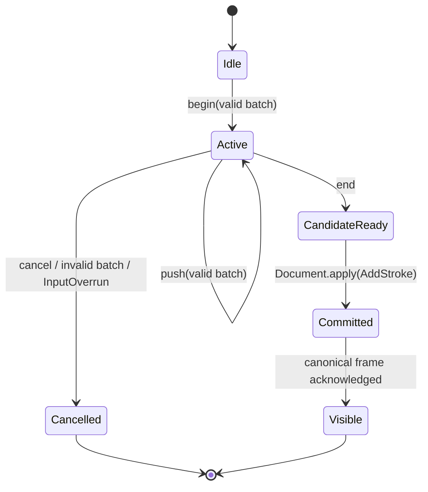

# POC-02 Pointer, Stroke, and Preview Contract

Status: **Experimental POC contract**

Consumers: POC-02 platform adapters and POC-06 FastInk design

Compatibility promise: **none beyond this POC branch**

## 1. Coordinate and input contract

`PointerSample.position` is in View Logical coordinates. Every non-empty
`PointerSampleBatch` binds its samples to one `ViewId`, viewport revision,
device descriptor, and finite affine View Logical-to-World transform. A batch
is rejected as a whole when its transform is singular/non-finite, its samples
are non-finite, its pointer or sample sequence changes unexpectedly, or its
timestamps move backward. Canonical geometry stores only transformed World
coordinates.

The platform adapter supplies historical/coalesced samples as a batch. Android
uses `MotionEvent` history directly in the Native `CanvasInkView` and JNI; the
pen data plane does not traverse React Native JavaScript. Web uses coalesced
`PointerEvent` samples. Windows must batch native history in the same shape when
physical pen input is connected.

The capability flags state whether pressure, tilt, contact size, hover, barrel,
eraser tip, and palm classification are meaningful. Missing pressure maps to
`0.5`; missing tilt maps to zero. POC-02 rejects platform-classified palm,
hover, and eraser-tip input before a session begins. It freezes their taxonomy,
not a product arbitration or eraser algorithm.

## 2. StrokeSession state machine



- `begin` creates one Stroke ID and emits a reliable Preview begin event.
- `push` validates and transforms the whole batch before mutation, appends the
  confirmed semantic samples, incrementally builds geometry, and emits a new
  Preview revision.
- `end` performs no whole-stroke geometry rebuild. It yields the already-built
  Canonical Stroke to `InputRouter`, which applies exactly one `AddStroke`
  operation atomically.
- `cancel` removes Preview state and never modifies the Document.
- Preview ownership is not retired merely because the operation committed. A
  render target must acknowledge the matching Document revision as visible.

Only one session is active in the experimental router. A new session cannot
begin while a prior Canonical stroke is waiting for its visible acknowledgement.

## 3. Canonical and Preview representations

One deterministic pipeline owns resampling, smoothing, pressure mapping,
brush interpretation, prediction, and rollback. It produces:

- a Canonical Stroke containing confirmed World-space samples plus Vector
  points or Dab records; and
- a versioned `PreviewStrokeUpdate` containing a confirmed append and a fully
  replaceable predicted tail.

Prediction is display-only. A new confirmed update replaces prior prediction;
predicted primitives never enter a Stroke, Operation, Document, or semantic
digest. Vector strokes store centerline points/radii; Dab strokes store stable
position/radius/rotation/opacity records. Neither stores `SkPath`, pixels, GPU
resources, or a platform surface.

`BrushDescriptor` participates in the Stroke digest. POC-02 accepts only brush
and algorithm version 1. Dab randomness uses PCG32 seeds domain-separated by
algorithm version, brush version, Stroke ID, random-stream domain, and item
index. Wall clock and process-global randomness are forbidden.

## 4. Bounded queues and backpressure

`PointerBatchQueue` has explicit batch, sample, byte, maximum-batch, and oldest
sample-age limits. It merges only adjacent batches with identical view,
viewport, transform, and device identity plus continuous sample sequence and
nondecreasing timestamps. Exceeding any limit returns `InputOverrun`, cancels
the entire active session, clears queued input, and leaves the Document
unchanged. Successful completion therefore implies 100% confirmed-input
preservation; silent dropping is forbidden.

`PreviewUpdateQueue` is a bounded data-plane queue. It may coalesce consecutive
updates for the same Stroke/view/viewport/brush when the newer truncate/append
operation can be expressed from the older retained prefix. Coalescing replaces
the predicted tail and keeps the newest revision. Capacity failure is explicit;
it is never presented as successful delivery.

Preview lifecycle is a separate reliable control plane:

```text
begin → zero or more PreviewStrokeUpdate → canonicalCommitted
                                      └──→ cancel
canonicalCommitted → canonicalVisible
```

`begin`, `canonicalCommitted`, `canonicalVisible`, and `cancel` do not enter the
coalescing update queue. POC-06 must preserve their order and delivery across
the platform bridge, including recovery after a backend or surface failure.

## 5. Frame scheduling and handoff

Input cadence, Preview production, render cadence, and display presentation are
separate. A platform scheduler receives coalescible invalidations per View and
allows at most one pending callback. Each render target has a generation;
callbacks and presentations for stale generations are rejected after resize,
background/foreground, surface recreation, or device loss.

The Canonical handoff protocol is:

1. incrementally complete the Canonical candidate;
2. atomically apply `AddStroke` to the Document;
3. mark Preview `canonicalCommitted` and discard its predicted tail;
4. render the committed Document revision without drawing the Preview on top;
5. acknowledge that exact revision as visible;
6. allow Preview resources to retire and the next Stroke to begin.

The acknowledgement is semantic in POC-02. POC-06 must connect it to actual
platform presentation evidence and prove a handoff within two display frames
without a blank frame or dark double-render.

## 6. Operation and recovery boundary

The experimental `AddStroke` NDJSON is a strict replay schema, not a file or
network protocol. A pointer fixture is applied through `StrokeSession`, yields
one operation, and that operation is serialized, parsed, and replayed into a
new empty `StrokeDocument`. Equal Stroke and Document digests prove the
operation-driven architecture assumption.

POC-02 does not define a durable Operation Log, Snapshot encoding, compaction,
Undo/Redo, CRDT/OT, collaboration transport, or recovery protocol. It does
establish the minimum direction:

```text
user input → Command/Operation → Document → Renderer
```

Direct platform/UI mutation of Scene or Document internals is outside the
contract.

## 7. POC-06 FastInk upstream requirements

POC-06 may replace `DefaultPreviewSink` with a platform bridge, but it must not
fork the Stroke algorithm. A conforming `FastInkBackend`:

- receives the same versioned `PreviewStrokeUpdate` revision sequence after
  allowed queue coalescing;
- owns only platform buffers, surface/presentation, acknowledgement, and
  failure recovery;
- does not receive raw pointer data to redo smooth/predict/brush logic;
- treats lifecycle control messages as reliable and ordered;
- can fail or fall back without losing or changing the Canonical Stroke; and
- never leaks DirectComposition, SurfaceControl, DRM/HWC, DOM, or GPU types into
  this common C++ semantic model.

The exact cross-thread buffer ownership, binary ABI, fences, platform thread,
and presentation API remain POC-06 decisions.
