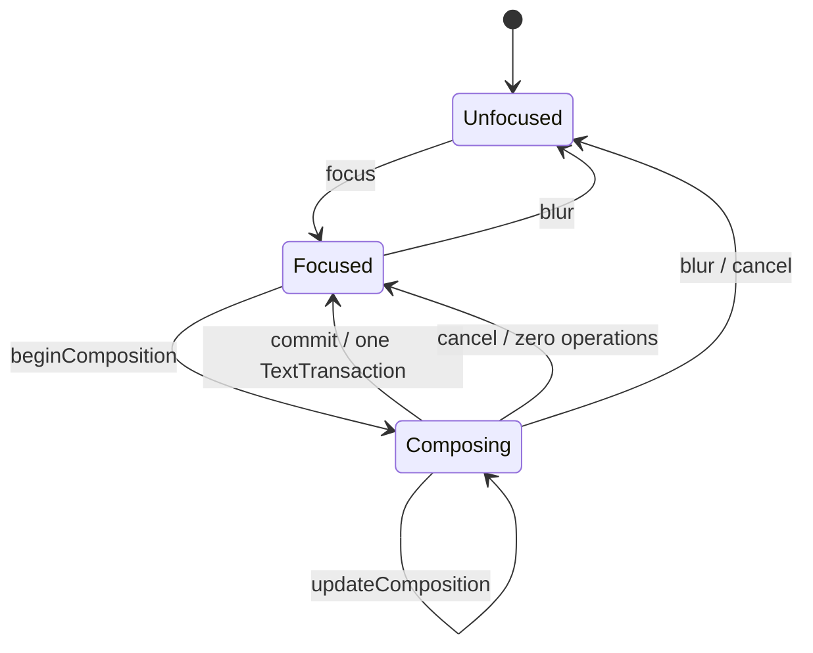

# POC-04 RichText / IME Contract

Status: `Implementing / SDK publication pending`

## Logical positions and schema

`LogicalPosition = { paragraph, offset_utf16 }`. Offsets count UTF-16 code
units, matching Windows and Android IME APIs. They do not count bytes, Unicode
scalar values, grapheme clusters, or shaped glyphs. Grapheme-safe cursor
movement is a layout/edit policy layered over this canonical storage position.

A `TextDocument` contains ordered paragraphs, ordered runs, paragraph
attributes, and run styles. Newlines exist at paragraph boundaries and are
serialized explicitly by the replay format. A style carries canonical
`FontResourceId`, expected content hash, size, color, weight, slant, locale,
an ordered content-addressed fallback chain, and sorted extensible attributes.

Snapshot and NDJSON formats are strictly versioned POC replay fixtures. Unknown
or missing fields, invalid UTF, invalid ranges, non-contiguous sequences, and
partially styled UTF-16 text reject the complete replay batch without changing
the original document.

## IME state machine



The composition preview and its internal selection are `TextEditSession`
state. Canonical document digest, snapshot, operation log, undo history, and
collaboration boundary see only commit. Platform adapters own neither a shadow
document nor an alternative undo stack.

`TextInputAdapter` adapts selection, before/after-cursor queries, committed and
composing text, directional deletion, and undo/redo without maintaining a
second authoritative document. UTF-16 deletion boundaries are expanded when
necessary so a platform request cannot split a surrogate pair. Grapheme-aware
cursor and deletion policy remains a product-layer extension over the POC's
UTF-16 storage contract.

## Operation and collaboration boundary

One IME commit, direct input event, paste, deletion, undo, or redo is one
`TextTransaction` containing one or more ordered replacements. A future
Collaboration MVP may transport this transaction as one atomic object. This POC
does not define CRDT/OT semantics, network encoding, concurrent RichText merge,
or server compaction.

The invariant under test is:

```text
Snapshot N + TextTransactions N+1..M = Document State M
```

Replaying committed operations from an empty document and snapshot
serialize/deserialize must reproduce the same digest.

## Font and layout determinism

Canonical layout resolves fonts only from verified blobs. The declared chain is
ordered and content-addressed; system-installed fonts are never consulted.
Missing ID, hash mismatch, exhausted fallback, and resource replacement have a
deterministic diagnostic and resolver generation so layout cache invalidation
cannot be missed.

The fixed POC corpus uses the pinned Roboto and Skia's pinned Noto Sans CJK
subset. These are test oracles, not a claim that the V1 product font set is
complete. SkParagraph + SkShaper + bundled HarfBuzz/ICU supplies line,
grapheme/cluster, caret, and selection geometry. The lightweight host probe is
explicitly non-canonical.

## Performance and lifecycle gates

- 10K-character ordinary input and caret movement: p95 no greater than 16.7 ms.
- 10K-character full canonical layout: p95 no greater than 33.3 ms.
- 100 focus/unfocus/view-destroy cycles: no crash or residual composition.
- Three-platform digest and fixed-font geometry: byte-for-byte equivalent dump.

These gates are accepted only from real Web, Windows, and Android artifacts.
Build-only checks and the host probe cannot satisfy the final exit conditions.
The automated canonical recorder directly exercises the shared Runtime and
SkParagraph on each target. Native IME delivery is tracked independently:
browser composition events, Win32 IMM messages, and Android InputConnection
callbacks must be observed on their actual platform before POC-04 can be
marked Accepted. A synthetic C++ composition call is not native IME evidence.
